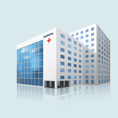
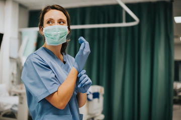

# THE PEOPLES HOSPITAL DOCUMENTATION
### NOTE: This is the documentation of The Peoples Hospital management system and how to incorporate it into your desktop and run it.
Here's a step-by-step guide on how to get this project from GitHub and run it on your desktop:
### Prerequisites:
**Git:** A version control system to clone the repository. You can download it from the official Git website.   
**Required Tools:** Ensure you have the necessary tools (npm, Node.js, mysql, vs code.) to run the project, depending on its programming language.
### Steps:
**Find the Repository:**
- Go to GitHub and search for the project you want.
- Once you find it, navigate to the repository's main page.
**Clone the Repository:**
- Using the Command Line:
- Open your terminal or command prompt.
- Navigate to the directory where you want to clone the repository.
Use the git clone command followed by the repository's URL:
```bash
git clone https://github.com/pauwan-github/Final_PLP_Project
```
**Using a Git Client:**
Use a Git client like GitHub Desktop or SourceTree.   
In the client, use the "Clone Repository" option and paste the repository's URL.
**Navigate to the Project Directory:**
- Open your terminal or command prompt.
- Use the cd command to navigate to the cloned repository's directory:
```bash
cd Final_PLP_Project
```
**Install Dependencies (if necessary):**

If the project has dependencies (mysql express bcryptjs express-validator express-session), you'll need to install them.
By running the following code on your terminal
```bash
npm install mysql express bcryptjs express-validator express-session
```
**Run the Project:**
Direct Execution: You might be able to directly execute the main file (e.g., node index.js for Node.js).

## 1.	Project Overview
### Introduction
The hospital management system documented here provides all the people with services to health practices and professionals in the line of medicine. This Hospital Management System provides a streamlined way for hospitals to manage information. 
It features pages such as:
a)	Homepage
b)	Services (incudes Outpatient, Consultant Clinics, Cardiac Programs and Telemedicine)
c)	Gallery (includes photos, videos and audio incorporated)
d)	Contact Us
e)	Login
f)	Sign-Up
g)	Admin Login
The project is implemented using HTML, CSS, JavaScript ( for both client-side and server-side), and MySQL for the database.

## 2.	System Architecture
The system follows a three-tier architecture:
a)	Presentation Layer (user interface) - Built with HTML, CSS and JavaScript.
b)	Application Layer - Node.js handles the server-side logic, manages user requests, processes data, and communicates with the database.
c)	Data Layer - MySQL is used as the database for managing users, and service details.
It’s simply Frontend (HTML, CSS, JS)  Backend (Node.js, Express.js)  Database (MySQL).

## 3.	Technologies and Packages
IDE’s to install visit the links in brackets to install the software’s below. Note that node.js comes having npm(node package manager).
- [Visual Studio Code](https://code.visualstudio.com/)
- [Node.js](https://nodejs.org/en)
- Npm
-	[Mysql workbench](https://www.mysql.com/)
After installing the above soft wares: Open your Visual studio code and press ctrl + back-tick (`) to open a terminal. Write the following codes.
```bash
-	node –v # (to check if the node.js is installed and to check out its version)
```

```bash
-	npm –v # (to check if the npm is installed and to check out its version)
```

```bash
-	mysql –u root –p # (to open up mysql workbench and after confirming it’s working write exit on the terminal to close it)
```
Languages and Frameworks
-	Frontend - HTML, CSS, JavaScript
-	Backend - Node.js, Express.js
-	Database - MySQL
Packages and Libraries
-	bcrypt for password hashing
-	MySQL package for Node.js to interact with the database
-	Express for server creation and handling routes
-	Express-validator library for validating and sanitizing user input in Express.js applications.
-	Body-Parser is a middleware that parses incoming request bodies in a middleware before handlers, making it easier to access form data in req.body.
-	Express session is middleware for managing sessions in Express.js. It stores session data on the server and provides each user with a unique session ID, sent via cookies.
```json
{
  "dependencies": {
    "express": "^4.17.1",
    "mysql": "^2.18.1",
    "bcrypt": "^5.0.1"
  }
}
```
## 4.	Frontend Structure and Code
Each page is structured as an HTML file and styled with CSS.
```html
-	**Homepage (The Peoples Hospital.html)**
<!DOCTYPE html>
<html lang="en">
<head>
    <meta charset="UTF-8">
    <meta name="viewport" content="width=device-width, initial-scale=1.0">
    <title>The People's Hospital</title>
    <style>
        /* Apply styles for larger screens */
@media only screen and (min-width: 600px) {
    /* Adjust layout for screens wider than 600px */
    .container {
        width: 80%; /* Adjust as needed */
        margin: 0 auto;
    }
}
/* Apply styles for even larger screens */
@media only screen and (min-width: 900px) {
    /* Adjust layout for screens wider than 900px */
    .container {
        width: 60%; /* Adjust as needed */
    }
}
        #container{
            display:flex;
            margin-left: 0px;
            background-color: lightgray;
            padding-left: 50px;
            padding-bottom: 10px;
            list-style: none;
        }
        header{
            margin-left: 30px;
            padding-top: 10px;
            font-size: 18px;
            font-family: 'Trebuchet MS', 'Lucida Sans Unicode', 'Lucida Grande', 'Lucida Sans', Arial, sans-serif;
        }
        .goals{
        background-image: url('pics/hosp.jpg');
        background-size: cover;
        background-repeat: no-repeat;
         min-height: 100vh;
        display: flex;
        flex-direction: column;
        justify-content: center;
        display:flex;
        }
        .goals0{
            display: flex;
            opacity: 0.7;
            margin-bottom: 0px;
        }
        .goal1{
            margin-left: 50px;
            width: 300px;
            height: 150px; 
            background-color: white;
            padding-left: 20px;
            color: black;
            border-radius: 10px;
        }
        .about{
            background-color: white;
            align-items: center;
            margin-left: 50px;
            font-size: 25px;
            padding-top: 10px;
            padding-bottom: 10px;
        }
        .back{
            background-color: #a17171;
            font-size: 25px;
            margin-top: 10px;
            margin-bottom: 10px;
            padding-top: 10px;
            padding-bottom: 10px;
        }
        .foot{
    background-color: #333;
    color:#fff;
    text-align: center;
    margin-top: 10px;
    padding: 1px;
    position: fixed;
    bottom: 0;
    width: 100%;
}
.con{
            display:flex;
            margin-left: 0px;
            background-color: lightgray;
            padding-left: 20px;
            margin-bottom: 0px;
            list-style: none;
            margin-top: 10px;
            justify-content: space-evenly;
            margin-bottom: 60px;
        }
        footer{
            padding-top: 10px;
            padding-left: 25px;
            padding-bottom: 10px;
        }
        ul{
            list-style: none;
        }
        .dropdown{
            position: relative;
            display: inline-block;
        }
        .cta{
            display: inline-block;
            padding: 10px 20px;
            background-color: skyblue;
            font-size: 15px;
            border: none;
            border-radius: 5px;
            cursor: pointer;
            color: navy;
            font-weight: bold;
            transition: background-color 0.3s ease;
        }
        .cta:hover{
            background-color: blue;
            opacity: 1;
        }
        .dropdown-content{
            display: none;
            position: absolute;
            top: 100%;
            left: 0;
            background-color: #fff;
            border: 1px solid #ccc;
            border-radius: 5px;
            box-shadow: 0 2px 5px rgba(0, 0, 0, 0.3);
            z-index: 1;
            opacity: 0.8;
        }
        .dropdown-content a{
            display: inline-block;
            padding: 10px 20px;
            font-size: 15px;
            color: #333;
            text-decoration: none;
            transition: background-color 0.3s ease;
        }
        .dropdown-content a:hover{
            background-color: #f2f2f2;
        }
        .dropdown:hover .dropdown-content{
            display: block;
        }
        #bar{
    margin-top: 30px;
    background-color: skyblue;
    text-align: center;
    padding-left: 5px;
    padding: 5px;
    border-radius: 5px;
    margin-left: 0px;
}
    #bar ul li{
    display: inline; 
}
#bar ul li a{
    text-decoration: none;
    font-weight: bold;
    padding-left: 5px;
    padding-right: 15px;
    padding-bottom: 10px;
    padding-top: 10px;
    transition: 500ms;
    margin-left: 5px;
    margin-right: 50px;
    margin-bottom: 20px;
}
#active{
    background-color: red;
    color: yellow;
    border-radius: 5px;
}
#bar ul li a:hover{
    background-color: blue;
    color: white;
    transition: 500ms;
    border-radius: 10px;
}
.img{
    padding-left: 30px;
    padding-top: 0px;
    border-radius: 5px;
}
.open{
    display: flex;
    background-color: white;
    margin-top: 10px;
    margin-bottom: 10px;
    margin-left: 50px;
    justify-content: space-evenly;
}
.open1{
    padding-top: 10px;
    padding-bottom: 10px;
    background-color: aqua;
    height: 150px;
    Width: 300px;
    padding-left: 10px;
    font-size: 18px;
    border-radius: 10px;
}
.who{
    font-size: 25px;
    text-align: center;
    font-weight: bold;
    margin-top: 50px;
    font-family: Verdana, Geneva, Tahoma, sans-serif;
    margin-bottom: 10px;
}
.who1{
    display: flex;
    justify-content: center;
    margin-top: 10px;
    margin-bottom: 10px;
}
.who2{
    padding-top: 10px;
    padding-bottom: 10px;
    height: 150px;
    Width: 300px;
    padding-left: 10px;
    font-size: 18px;
    margin-right: 20px;
}
table, th, td{
        border: 2px solid black;
        border-collapse: collapse;
    }
    th, td{
        padding: 1px;
        width: 1%;
        padding-top: 1px;
        padding-bottom: 1px;
        text-align: center;
        color: #fff;
    }
    table#alter tr:nth-child(even){
        background-color: skyblue;
    }
    table#alter tr:nth-child(odd){
        background-color: grey;
    }
    table#alter th{
        color: White;
        background-color: skyblue;
    }
.cont0{
    background-image: url('pics/hosp18.jpg');
    background-repeat: no-repeat;
    display: flex;
    margin-left: 0px;
    padding-left: 0px;
    margin-right: 30px;
    text-align: center;
   background-size: cover;
}
.cont1{
      color: black;
   padding-left: 50px;
   padding-right: 10px;
   width: 100%;
   height: 200px;
   padding-top: 80px;
   padding-bottom: 20px;
}
    </style>
</head>
<body>
    <div id="container">
    <header>&nbsp Roysambu, Jewellery Complex Plaza, Ground Floor</header>
    <header>&nbsp peopleshosp@gmail.com </header>
    <header>&nbsp +254716684446</header>
    <header><a href="login.html">Login</a></header>
    <header><a href="signup.html">Sign up</a></header>
    <header><a href="Admin.html">Admin</a></header>
    </div>
    <div id="container">
        <div class="img">
    <a href="pics/2.png"></a></div>
    <header>
    <div id="bar">
        <ul Alink="gold" Vlink="white" link="blue">
            <li><a href="#" id="active">Home</a></li>
            <li><div class="dropdown">
                <button class="cta">Services</button>
                <div class="dropdown-content">
                    <strong><a href="healthservices.html">Inpatient</a></strong>
                <strong><a href="outpatient.html">Outpatient</a></strong>
                    <strong><a href="clinic.html">Consultant Clinics</a></strong>
                    <strong><a href="cardiac.html">Cardiac Programs</a></strong>
                    <strong><a href="tele.html">Telemedicine</a></strong>
                </div>
            </div></a></li> 
            <li><a href="gal1.html">Gallery</a></li>
            <li><a href="contactus.html">Contacts</a></li>
        </ul>
    </div>
    <li><a href="#alter">Schedule</a></li>
</header>
</div>
<div class="goals">
    <div class="goals0">
    <div class="goal1">
    <Strong><h3>Our Motto</h3></Strong>
    Best services to all.
    </div>
    <div class="goal1">
        <strong><h3>Vision</h3></strong>
        To help people live comfortable lives in good health.
        </div>
        <div class="goal1">
            <strong><h3>Mission</h3></strong>
            To reach even to the remote of areas and offer services to people.
        </div>
    </div>
</div>
<div class="open">
    <div class="open1">
        <h3>Emergency Cases</h3>
        Call Centre on 07******** / 07******** / 
        Our Accidents and Emergency Department on 07********
    </div>
    <div class="open1">
        <h3>Consultants Timetable</h3>
        View our Specialist Clinic Schedule for your planning. 
        We are ready to serve you and your family.
    </div>
    <div class="open1">
<h3> Opening hours</h3>
Monday - Saturday          Open
Sundays                    Open
Public Holidays            Open
    </div>
</div>
<div class="who">
    #We Are Always Ready To Help You &<br> Your Family
</div>
<center>We perform to the best of our ability to achieve the highest attainable standard</h4></center>
<div class="about">
    <div class="who1">
        <div class="who2">
    <h3>Emergency Help</h3>
We provide quick emergency responses when you call our emergency numbers
        </div>
        <div class="who2">
            <h3>Enriched Pharmacy</h3>
Our pharmacies are fully equipped with drugs to cure ailments and fasten your recovery.
        </div>
        <div class="who2">
            <h3>Medical Treatment</h3>
We provide quality health care to our customers and clients.
        </div>
    </div>
    <div class="cont0">
        <div class="cont1">
<h3>176</h3>
Hospital Rooms
        </div>
        <div class="cont1">
            <h3>Many</h3>  
            Specialist Doctors
        </div>
        <div class="cont1">
            <h3>Many</h3>  
           Happy Patients
        </div>
        <div class="cont1">
            <h3>25</h3>  
           Years of Service
        </div>
    </div>
    <center><strong><h3>About Us</h3></strong></center>
    <p>The People's Hospital is found along Thika Super Highway on Jewellery Complex Plaza Ground Floor in Roysambu. We are licensed by <strong>Ministry Of Health (MOH)</strong> to conduct health practices to people. We are registered by the <b>Kenya Revenue Authorities (KRA) </b>and allocated <strong>KRA PIN A018819456Q.</strong></p>
    <div class="back">
        <center><strong><h3>Background</h3></strong></center>
    <p>The People's Hospital was found on the 2<sup>nd</sup>July, 1999 by: <dl><dt>Dr. Philips Johnson</dt> <dd>-PhD Neurolody</dd> <dd>-MSc Drug and Substance Abuse</dd> <dd>-BSc Cardiolody</dd> <dt>Prof. Sarah Kamau</dt> <dd>-PhD Paeditry</dd> <dd>-MSc Human Resource</dd> <dd>-BSc Nursing</dd> <dt>Dr. Melvin Teddy</dt> <dd>-PhD Bio Chemisrty</dd> <dd>-MSc Phsychology</dd> <dd>-BSc Gynaecology</dd></dl></p>
</div>
</div>
<h3><center><strong><hr>This is our main hospital specialists schedule</hr></strong></center></h3><br>
    <table id="alter">
        <tr>
            <th colspan="4"><h2>Departments</h3></th>
        </tr>
        <tr>
            <td><h3>Services</h3></td>
            <td><h3>Day</h3></td>
            <td><h3>Time</h3></td>
            <td><h3>Doctor</h3></td>
        </tr>
        <tr>
            <td rowspan="4"><h5>Paeditriac</h5></td>
            <tr>
                <td><h5>Mondays</h5></td>
                <td><h5>8:00am - 5:00pm</h5></td>
                <td><h5>Prof. Sarah Kamau</h5></td>
            </tr>
            <tr>
                <td><h5>Tuesdays</h5></td>
                <td><h5>10:00am - 8:00pm</h5></td>
                <td><h5>Dr. Onesmus Obondi</h5></td>
            </tr>
            <tr>
                <td><h5>Fridays</h5></td>
                <td><h5>9:00am - 9:00pm</h5></td>
                <td><h5>Prof. Sarah Kamau</h5></td>
            </tr>
        </tr>
        <tr>
            <td rowspan="3"><h5>Dentistry</h5></td>
            <tr>
                <td><h5>Mondays</h5></td>
                <td><h5>11:00am - 5:00pm</h5></td>
                <td><h5>OJ Kipkoech</h5></td>
            </tr>
            <tr>
                <td><h5>Wednesdays</h5></td>
                <td><h5>8:00am - 8:00pm</h5></td>
                <td><h5>Dr. Catherine Kyalo</h5></td>
            </tr>
        </tr>
        <tr>
            <td rowspan="7"><h5>Maternity</h5></td>
                <td><h5>Mondays</h5></td>
                <td><h5>24Hrs</h5></td>
                <td><h5>Dr. Melvin Teddy and Felista Akinyi</h5></td>
        </tr>
        <tr>
                <td><h5>Tuesdays</h5></td>
                <td><h5>24Hrs</h5></td>
                <td><h5>Dr. Kennedy Osiando Carol Lung'aho</h5></td>
        </tr>
        <tr>
                <td><h5>Wednesdays</h5></td>
                <td><h5>24Hrs</h5></td>
                <td><h5>Dr. Bridget Adhiambo and Justina Wamae</h5></td>
        </tr>
        <tr>
                <td><h5>Thursdays</h5></td>
                <td><h5>24Hrs</h5></td>
                <td><h5>Dr. Melvin Teddy and Margaret Obondi</h5></td>
        </tr>
        <tr>
                <td><h5>Fridays</h5></td>
                <td><h5>24Hrs</h5></td>
                <td><h5>Dr. James Kamau and Pricilla Zawadi</h5></td>
        </tr>
        <tr>
                <td><h5>Saturdays</h5></td>
                <td><h5>24Hrs</h5></td>
                <td><h5>Dr. Melvin Teddy and Immaculate Njeri</h5></td>
        </tr>
        <tr>
                <td><h5>Sundays</h5></td>
                <td><h5>24Hrs</h5></td>
                <td><h5>Dr. Paul Peter and Mercy Mukunga</h5></td>
        </tr>
        <tr>
            <td rowspan="7"><h5>Medical Check-Up</h4></td>
                <td><h5>Mondays</h5></td>
                <td><h5>24Hrs</h5></td>
                <td><h5>Kelvin Kamau and Atieno Kathuri</h5></td>
        </tr>
        <tr>
                <td><h5>Tuesdays</h5></td>
                <td><h5>24Hrs</h5></td>
                <td><h5>Otiende Amollo and Norah Mueni</h5></td>
        </tr>
        <tr>
                <td><h5>Wednesdays</h5></td>
                <td><h5>24Hrs</h5></td>
                <td><h5>Dr. Rose Bukuku and Frances Ben</h5></td>
        </tr>
        <tr>
                <td><h5>Thursdays</h5></td>
                <td><h5>24Hrs</h5></td>
                <td><h5>Dr. Chinnenye Nnebe and Ray Emodi</h5></td>
        </tr>
        <tr>
                <td><h5>Fridays</h5></td>
                <td><h5>24Hrs</h5></td>
                <td><h5>Dr. Annan Chekwuemeka and Doris Ifeka</h5></td>
        </tr>
        <tr>
                <td><h5>Saturdays</h5></td>
                <td><h5>24Hrs</h5></td>
                <td><h5>Dr. Pamela Okoye and Adelana Tana</h5></td>
        </tr>
        <tr>
                <td><h5>Sundays</h5></td>
                <td><h5>24Hrs</h5></td>
                <td><h5>Dr. Chike Daniels and Stella Udeze</h5></td>
        </tr>
    </table>
    <a href="#bar"><h3><p align="right">GO UP</p></h3></a>
<hr>
<div class="con">
    <footer>
        <a href="pics/2.png"></a>
    </footer>
    <footer>
        <strong><h3>Quick Links</h3></strong>
        <ul>
            <li><a href="#">Home</a></li>
            <li><div class="dropdown">
                <button class="cta">Services</button>
                <div class="dropdown-content">
                    <strong><a href="healthservices.html">Inpatient</a></strong>
                <strong><a href="outpatient.html">Outpatient</a></strong>
                <strong><a href="clinic.html">Consultant Clinics</a></strong>
                <strong><a href="cardiac.html">Cardiac Programs</a></strong>
                <strong><a href="tele.html">Telemedicine</a></strong>
                </div>
            </div></a></li>
            <li><a href="gal1.html">Gallery</a></li>
            <li><a href="contactus.html">Contact Us</a></li>
        </ul>
    </footer>
    <footer><strong><h3>Contact Us</h3></strong>
    The People's Hospital<br>Jewel Complex, Roysambu<br>PO BOX 1212-00100, Nairobi,<br>Kenya<br>TEL: +254 735 143 953<br>+254 716 684 446<br>temdinguri1@gmail.com
   </footer>
<footer><strong><h3>Socials</h3></strong>
<ul>
    <li><a href="https://www.instagram.com/_pau.wan"> Instagram</a></li>
    <li><a href="https://www.facebook.com/paul.wanjuki.3"> Facebook</a></li>
    <li><a href="https://twitter.com/Temdinguri"> Twitter</a></li>
    <li><a href="https://wa.me/254716684446"> Whatsapp</a></li>
</ul></footer>
</div>
    <div class="foot">
        <p>&copy 2024 The People's Hospital. All rights reserved</p>
    </div>
</body>
</html>    <header>
        <h1>Welcome to Our Hospital Management System</h1>
        <nav>
            <a href="services.html">Services</a>
            <a href="about.html">About Us</a>
            <a href="contact.html">Contact Us</a>
            <a href="gallery.html">Gallery</a>
            <a href="login.html">Login</a>
        </nav>
    </header>
</body>
</html>
```
## - **Services (incudes Outpatient, Consultant Clinics, Cardiac Programs and Telemedicine)**
**a.	Inpatient (healthservices.html)**
```html
<!DOCTYPE html>
<html lang="en">
<head>
    <meta charset="UTF-8">
    <meta name="viewport" content="width=device-width, initial-scale=1.0">
    <title>Services</title>
    <div id="bar">
        <ul Alink="gold" Vlink="white" link="blue">
            <li><a href="The Peoples Hospital.html">Home</a></li>
            <li><div class="dropdown">
                <button class="cta" id="active">Services</button>
                <div class="dropdown-content">
                    <strong><a href="#" id="active">Inpatient</a></strong>
                    <strong><a href="outpatient.html">Outpatient</a></strong>
                    <strong><a href="clinic.html">Consultant Clinics</a></strong>
                    <strong><a href="cardiac.html">Cardiac Programs</a></strong>
                    <strong><a href="tele.html">Telemedicine</a></strong>
                </div>
            </div></a></li>
            <li><a href="gal1.html">Gallery</a></li>
            <li><a href="contactus.html">Contacts</a></li>
            <li><a href="login.html">Login</a></li>
            <li><a href="signup.html">Sign up</a></li>
            <li><a href="Admin.html">Admin</a></li>
        </ul>
    </div>
    <style>
        #bar{
    margin-top: 10px;
    background-color: skyblue;
    text-align: center;
    padding-left: 15px;
    padding: 5px;
    border-radius: 5px;
}
#bar ul li{
    display: inline; 
}
#bar ul li a{
    text-decoration: none;
    font-weight: bold;
    padding-left: 15px;
    padding-right: 15px;
    padding-bottom: 10px;
    padding-top: 10px;
    transition: 500ms;
    margin-left: 50px;
    margin-right: 50px;
    margin-bottom: 20px;
}
#active{
    background-color: red;
    color: yellow;
    border-radius: 5px;
}
#bar ul li a:hover{
    background-color: blue;
    color: white;
    transition: 500ms;
    border-radius: 10px;
}
        #inpatient{
            font-size: 25px;
            font-family: Cambria, Cochin, Georgia, Times, 'Times New Roman', serif;
        }
        #feeds{
            background-color: green;
            border-radius: 10px;
            margin-top: 20px;
            padding-left: 50px;
            padding-right: 50px;
            font-size: 35px;
            font-family: Georgia, 'Times New Roman', Times, serif;
            margin-bottom: 10px;
        }
        #pic{
            border-radius: 10px;
            padding-left: 200px;
            padding-top: 50px;
        }
        header{
            background-color:cyan;
            color: red;
            padding: 1px;
        }
        .unordered-list-container{
            display: flex;
        }
            .horizontal-list{
                list-style:none;
                display: flex;
            }
            .horizontal-list li{
                margin-left: 100px;
            }
            .display{
                text-align: center;
                padding-top: 0px;
                margin-top: 0px;
                width: 75%;
                height: 0%;
                position:relative;
                margin-left: 200px;
                margin-right: 200px;
            }
            .display img{
                max-width: 100%;
                border-radius: 5px;
                width: 100%;
                opacity: 100;
            }
            .background-container{
                background-color: skyblue;
                background-size: cover;
                background-repeat: no-repeat;
                min-height: 100vh;
                display: flex;
                flex-direction: column;
                justify-content: center;
                align-items: center;
                color: #fff;
            }
            .background-container::before{
                content: "";
                background: inherit;
                position: fixed;
                top: 0;
                left: 0;
                right: 0;
                bottom: o;
                z-index: -1;
                opacity: 0;
            }
            .dropdown{
            position: relative;
            display: inline-block;
        }
        .cta{
            display: inline-block;
            padding: 10px 20px;
            background-color: skyblue;
            font-size: 15px;
            border: none;
            border-radius: 5px;
            cursor: pointer;
            color: navy;
            font-weight: bold;
            transition: background-color 0.3s ease;
        }
        .cta:hover{
            background-color: blue;
            opacity: 1;
        }
        .dropdown-content{
            display: none;
            position: absolute;
            top: 100%;
            left: 0;
            background-color: #fff;
            border: 1px solid #ccc;
            border-radius: 5px;
            box-shadow: 0 2px 5px rgba(0, 0, 0, 0.3);
            z-index: 1;
            opacity: 0.8;
        }
        .dropdown-content a{
            display: inline-block;
            padding: 10px 20px;
            font-size: 15px;
            color: #333;
            text-decoration: none;
            transition: background-color 0.3s ease;
        }
        .dropdown-content a:hover{
            background-color: #f2f2f2;
        }
        .dropdown:hover .dropdown-content{
            display: block;
        }
.foot{
    background-color: #333;
    color:#fff;
    text-align: center;
    margin-top: 10px;
    padding: 1px;
    position: fixed;
    bottom: 0;
    width: 100%;
}
/* Apply styles for larger screens */
@media only screen and (min-width: 600px) {
    /* Adjust layout for screens wider than 600px */
    .container {
        width: 80%; /* Adjust as needed */
        margin: 0 auto;
    }
}
/* Apply styles for even larger screens */
@media only screen and (min-width: 900px) {
    /* Adjust layout for screens wider than 900px */
    .container {
        width: 60%; /* Adjust as needed */
    }
}
.con{
            display:flex;
            margin-left: 0px;
            background-color: lightgray;
            padding-left: 20px;
            margin-bottom: 0px;
            list-style: none;
            margin-top: 10px;
            justify-content: space-evenly;
            margin-bottom: 60px;            
        }
        footer{
            padding-top: 10px;
            padding-left: 25px;
            padding-bottom: 10px;
        }
        ul{
            list-style: none;
        }
    </style>
</head>
<body>
    <header>
        <div class="unordered-list-container">
        <ul class="horizontal-list">
            <li>&nbsp;<a href="tel:0735143953">Call Customer Care</a></li>
            <li>&nbsp;<a href="mailto:paul.17458.kyu.ac.ke@gmail.com">Email Customer Care</a></li>
            <li>&nbsp;<a href="https://wa.me/+254716684446?text=Hi%20Paul">Whatsapp Customer Care</a></li>
        </ul>
    </div>
    </header>
    <div id="inpatient">
        <div class="background-container">
            <div class="display"></div>
            </div>
        <center><h1><strong>Inpatient</strong></h1></center>
        <p>
            With a bed capacity of 200, the hospital is capable of accomodating all types of patients. The General ward bed has a bed, locker, visitors chair and a common Tv Room. Private rooms have wash basins and Tv. En-suite rooms are self-contained and fitted with Tv.
        </p>
    </div>
    <div id="feeds">
        <sup></sup>
        The People's Hospital Intensive care Unit (ICU) was commissioned in 19<sup>th</sup> October, 2000 with a capacity of 20 beds covering both the Intensive Care and High Dependency. The High Dependency Unit takes care of patients who are transiting from ICU to wards as well as patients who require close monitoring but not necessarily in ICU. The ICU is conveniently allocated above the Accident and Emergency Unit and next to the main operating theatres.
    </div><br><br>
    <hr>
<div class="con">
    <footer>
        <a href="pics/2.png"></a>
    </footer>
    <footer>
        <strong><h3>Quick Links</h3></strong>
        <ul>
            <li><a href="The Peoples Hospital.html">Home</a></li>
            <li><div class="dropdown">
                <button class="cta">Services</button>
                <div class="dropdown-content">
                    <strong><a href="#">Inpatient</a></strong>
                <strong><a href="outpatient.html">Outpatient</a></strong>
                <strong><a href="clinic.html">Consultant Clinics</a></strong>
                <strong><a href="cardiac.html">Cardiac Programs</a></strong>
                <strong><a href="tele.html">Telemedicine</a></strong>
                </div>
            </div></a></li>
            <li><a href="gal1.html">Gallery</a></li>
            <li><a href="contactus.html">Contact Us</a></li>
        </ul>
    </footer>
    <footer><strong><h3>Contact Us</h3></strong>
    The People's Hospital<br>Jewel Complex, Roysambu<br>PO BOX 1212-00100, Nairobi,<br>Kenya<br>TEL: +254 735 143 953<br>+254 716 684 446<br>temdinguri1@gmail.com
    </footer>
<footer><strong><h3>Socials</h3></strong>
<ul>
    <li><a href="https://www.instagram.com/_pau.wan"> Instagram</a></li>
    <li><a href="https://www.facebook.com/paul.wanjuki.3"> Facebook</a></li>
    <li><a href="https://twitter.com/Temdinguri"> Twitter</a></li>
    <li><a href="https://wa.me/254716684446"> Whatsapp</a></li>
</ul></footer>
</div>
    <div class="foot">
        <p>&copy 2024 The People's Hospital. All rights reserved</p>
    </div>
    <script type="Text/Javascript">
        var images = ['pics/inpatient1.jpg','pics/inpatient2.jpg','pics/inpatient3.jpg','pics/inpatient4.jpg','pics/inpatient5.jpg','pics/inpatient6.jpg','pics/inpatient7.jpg','pics/inpatient8.jpg','pics/inpatient9.jpg','pics/inpatient10.jpg','pics/inpatient.jpg'];
var i =0;
function slideShow() {
    document.getElementById("display").src=images[i];
    if(i<images.length-1){
        i++;
    }
    else{
        i=0;
    }
    setTimeout("slideShow()" , 3000);
}
window.onload = slideShow;
    </script>
</body>
</html>
```
**b.	Outpatient (outpatient.html)**
```html
<!DOCTYPE html>
<html lang="en">
<head>
    <meta charset="UTF-8">
    <meta name="viewport" content="width=device-width, initial-scale=1.0">
    <title>Outpatient Services</title>
    <div class="footer1">
        <div class="unordered-list-container">
        <ul class="horizontal-list">
            <li>&nbsp;<a href="tel:0735143953">Call Customer Care</a></li>
            <li>&nbsp;<a href="mailto:paul.17458.kyu.ac.ke@gmail.com">Email Customer Care</a></li>
            <li>&nbsp;<a href="https://wa.me/+254716684446?text=Hi%20Paul">Whatsapp Customer Care</a></li>
            <li><a href="login.html">Login</a></li>
            <li><a href="signup.html">Sign up</a></li>
            <li><a href="Admin.html">Admin</a></li>
        </ul>
    </div>
    </div>
    <div id="bar">
        <ul Alink="gold" Vlink="white" link="blue">
            <li><a href="The Peoples Hospital.html">Home</a></li>
            <li><div class="dropdown">
                <button class="cta" id="active">Services</button>
                <div class="dropdown-content">
                    <strong><a href="healthservices.html">Inpatient</a></strong>
                    <strong><a href="#" id="active">Outpatient</a></strong>
                    <strong><a href="clinic.html">Consultant Clinics</a></strong>
                    <strong><a href="cardiac.html">Cardiac Programs</a></strong>
                    <strong><a href="tele.html">Telemedicine</a></strong>
                </div>
            </div></a></li>
            <li><a href="gal1.html">Gallery</a></li>
            <li><a href="contactus.html">Contacts</a></li>
        </ul>
    </div>
    <style>
        /* Apply styles for larger screens */
@media only screen and (min-width: 600px) {
    /* Adjust layout for screens wider than 600px */
    .container {
        width: 80%; /* Adjust as needed */
        margin: 0 auto;
    }
}
/* Apply styles for even larger screens */
@media only screen and (min-width: 900px) {
    /* Adjust layout for screens wider than 900px */
    .container {
        width: 60%; /* Adjust as needed */
    }
}
    body{
        background-color: #f2f2f2;
    }
     #bar{
    margin-top: 0px;
    background-image: url('pics/kilele.jpg');
    text-align: center;
    padding-left: 15px;
    padding: 1px;
}
    #bar ul li{
    display: inline; 
}
#bar ul li a{
    text-decoration: none;
    font-weight: bold;
    padding-left: 15px;
    padding-right: 15px;
    padding-bottom: 10px;
    padding-top: 10px;
    transition: 500ms;
    margin-left: 50px;
    margin-right: 50px;
    margin-bottom: 20px;
}
#active{
    background-color: red;
    color: yellow;
    border-radius: 5px;
}
#bar ul li a:hover{
    background-color: blue;
    color: white;
    transition: 500ms;
    border-radius: 10px;
}
header{
    background-image: url('pics/hosp3.jpg');
    background-repeat: no-repeat;
    background-size: cover;
    text-align: center;
    font-family: Arial, Helvetica, sans-serif;
    color: black;
    padding: 20px;
    margin-bottom: 10px;
    height: 100%;
}
.dropdown{
            position: relative;
            display: inline-block;
        }
        .cta{
            display: inline-block;
            padding: 10px 20px;
            background-color: skyblue;
            font-size: 15px;
            border: none;
            border-radius: 5px;
            cursor: pointer;
            color: navy;
            font-weight: bold;
            transition: background-color 0.3s ease;
        }
        .cta:hover{
            background-color: blue;
            opacity: 1;
        }
        .dropdown-content{
            display: none;
            position: absolute;
            top: 100%;
            left: 0;
            background-color: #fff;
            border: 1px solid #ccc;
            border-radius: 5px;
            box-shadow: 0 2px 5px rgba(0, 0, 0, 0.3);
            z-index: 1;
            opacity: 0.8;
        }
        .dropdown-content a{
            display: inline-block;
            padding: 10px 20px;
            font-size: 15px;
            color: #333;
            text-decoration: none;
            transition: background-color 0.3s ease;
        }
        .dropdown-content a:hover{
            background-color: #f2f2f2;
        }
        .dropdown:hover .dropdown-content{
            display: block;
        }
        .outee{
            display: flex;
        }
        .out{
            padding-top: 20px;
            margin-left: 120px;
            padding-right: 150px;
            padding-bottom: 20px;
        }
        .left-image{
            max-width: 100px;
            margin-left:0px;
        }
        .out1{
            padding-top: 20px;
            margin-left: 0px;
            padding-right: 200px;
            padding-bottom: 20px;
        }
        .left-image1{
            max-width: 100px;
            margin-left:0px;
        }
        .out2{
            padding-top: 20px;
            margin-left: 0px;
            padding-right: 120px;
            padding-bottom: 20px;
        }
        .left-image2{
            max-width: 100px;
            margin-left:0px;
        }
        .outee1{
            display: flex;
        }
        .out0{
            padding-top: 20px;
            margin-left: 120px;
            padding-right: 150px;
            padding-bottom: 20px;
        }
        .left-image0{
            max-width: 100px;
            margin-left:0px;
        }
        .out11{
            padding-top: 20px;
            margin-left: 130px;
            padding-right: 0px;
            padding-bottom: 20px;
        }
        .left-image11{
            max-width: 100px;
            margin-left:0px;
        }
        .out22{
            padding-top: 20px;
            margin-left: 185px;
            padding-right: 200px;
            padding-bottom: 20px;
        }
        .left-image22{
            max-width: 100px;
            margin-left:0px;
        }
        .outee2{
            display: flex;
        }
        .out00{
            padding-top: 20px;
            margin-left: 120px;
            padding-right: 80px;
            padding-bottom: 20px;
        }
        .left-image00{
            max-width: 100px;
            margin-left:0px;
        }
        .out111{
            padding-top: 20px;
            margin-left: 160px;
            padding-right: 10px;
            padding-bottom: 20px;
        }
        .left-image111{
            max-width: 100px;
            margin-left:0px;
        }
        .out222{
            padding-top: 20px;
            margin-left: 150px;
            padding-right: 60px;
            padding-bottom: 20px;
        }
        .footer1{
            background-color: yellow;
            color: red;
            padding: 0px;
        }
        .unordered-list-container{
            display: flex;
        }
            .horizontal-list{
                list-style:none;
                display: flex;
            }
            .horizontal-list li{
                margin-left: 100px;
            }
        .left-image222{
            max-width: 100px;
            margin-left:0px;
        }
        .outee3{
            display: flex;
        }
        .out000{
            padding-top: 20px;
            margin-left: 120px;
            padding-right: 80px;
            padding-bottom: 20px;
        }
        .left-image000{
            max-width: 100px;
            margin-left:0px;
        }
        .out1111{
            padding-top: 20px;
            margin-left: 100px;
            padding-right: 10px;
            padding-bottom: 20px;
        }
        .left-image1111{
            max-width: 100px;
            margin-left:0px;
        }
        .out2222{
            padding-top: 20px;
            margin-left: 200px;
            padding-right: 80px;
            padding-bottom: 20px;
        }
        .left-image2222{
            max-width: 100px;
            margin-left:0px;
        }
        .foot{
    background-color: #333;
    color:#fff;
    text-align: center;
    margin-top: 10px;
    padding: 1px;
    position: fixed;
    bottom: 0;
    width: 100%;
}
.con{
            display:flex;
            margin-left: 0px;
            background-color: lightgray;
            padding-left: 20px;
            margin-bottom: 0px;
            list-style: none;
            margin-top: 10px;
            justify-content: space-evenly;
            margin-bottom: 60px;            
        }
        footer{
            padding-top: 10px;
            padding-left: 25px;
            padding-bottom: 10px;
        }
        ul{
            list-style: none;
        }
    </style>
</head>
<body>
    <header><h1>Outpatient Services</h1>
        <h3><marquee behavior="scroll" direction="relative" scrollamount="5";>Welcome to  our <strong>Outpatient Services</strong></marquee></h3>
    </header>
    
    <div class="outee">
    <div class="out">
        <h4><strong>Accidents & Emergency</strong></h4>
        <font color="grey">Accident and Emergency unit has grown in its reputation to become one of the leading Accident & Emergency unit in the continent.</font>
    </div>
    <div class="out1">
        <h4><strong>Dental Services</strong></h4>
        <font color="grey">The People's Hospital Dental Care Clinic offers full range of dental services for adults and children.</font>
        </div>
    <div class="out2">
        <h4><strong>Laboratory</strong></h4>
        <font color="grey">Our laboratories provide confirmatory diagnosis and improved management of disease.</font>
    </div>
</div>
<div class="outee1">
<div class="out0">
    <h4><strong>Natural Family Planning</strong></h4>
    <font color="grey">This is fertility awarenesss which is simply knowledge of a couple's fertility </font>
</div>
<div class="out11">
    <h4><strong>Day Care Procedures</strong></h4>
    <font color="grey">Advances in medicine and technology have accorded us the opportunity to have some procedures done without being hospitalized</font>
</div>
<div class="out22">
    <h4><strong>Well Person Clinic</strong></h4>
    <font color="grey">This is a general checkup clinic for men and women.</font>
       </div>
</div>
        <div class="outee2">
        <div class="out00">
        <h4><strong>Maternity</strong></h4>
        <font color="grey">We specialize in caring for mothers during pregnancy and childbirth. </font>
        </div>
        <div class="out111">
        <h4><strong>Counselling Services</strong></h4>
        <font color="grey">We boast of our professional therapists whose approach to counselling is wholesome in addressing matters.</font>
        </div>
        <div class="out222">
        <h4><strong>Pharmacy</strong></h4>
        <font color="grey">We endevour to offer quality, efficient and professional pharmaceutical services to patients and other clients.</font>
        </div>
        </div>
      <div class="outee3">
        <div class="out000">
            <h4><strong>Radiology</strong></h4>
            <font color="grey">This unit provides hemodialysis for both in and outpatients with chronic or acute kidney disease requiring renal replacement therapy.</font>
        </div>
        <div class="out1111">
            <h4><strong>Physiotherapy</strong></h4>
            <font color="grey">The hospital physiotherapy unit is a modern and fully equipped unit with full time qualified and dedicated physiotherapists.</font>
        </div>
        <div class="out2222">
            <h4><strong>Renal unit</strong></h4>
            <font color="grey">This unit provides hemodialysis for both in and outpatients with chronic or acute kidney disease requiring renal replacement therapy.</font>
         </div>
    </div>
    <br><br>
    <hr>
<div class="con">
    <footer>
        <a href="pics/2.png"></a>
    </footer>
    <footer>
        <strong><h3>Quick Links</h3></strong>
        <ul>
            <li><a href="The Peoples Hospital.html">Home</a></li>
            <li><div class="dropdown">
                <button class="cta">Services</button>
                <div class="dropdown-content">
                    <strong><a href="healthservices.html">Inpatient</a></strong>
                <strong><a href="#">Outpatient</a></strong>
                <strong><a href="clinic.html">Consultant Clinics</a></strong>
                <strong><a href="cardiac.html">Cardiac Programs</a></strong>
                <strong><a href="tele.html">Telemedicine</a></strong>
                </div>
            </div></a></li>
            <li><a href="gal1.html">Gallery</a></li>
            <li><a href="contactus.html">Contact Us</a></li>
        </ul>
    </footer>
    <footer><strong><h3>Contact Us</h3></strong>
    The People's Hospital<br>Jewel Complex, Roysambu<br>PO BOX 1212-00100, Nairobi,<br>Kenya<br>TEL: +254 735 143 953<br>+254 716 684 446<br>temdinguri1@gmail.com
    </footer>
<footer><strong><h3>Socials</h3></strong>
<ul>
    <li><a href="https://www.instagram.com/_pau.wan"> Instagram</a></li>
    <li><a href="https://www.facebook.com/paul.wanjuki.3"> Facebook</a></li>
    <li><a href="https://twitter.com/Temdinguri"> Twitter</a></li>
    <li><a href="https://wa.me/254716684446"> Whatsapp</a></li>
</ul></footer>
</div>
    <div class="foot">
        <p>&copy 2024 The People's Hospital. All rights reserved</p>
    </div>
</body>
</html>
```
**c.	Consultant clinics (Clinic.html)**
```html
<!DOCTYPE html>
<html lang="en">
<head>
    <meta charset="UTF-8">
    <meta name="viewport" content="width=device-width, initial-scale=1.0">
    <title>Clinic</title>
    <style>
/* Apply styles for larger screens */
@media only screen and (min-width: 600px) {
    /* Adjust layout for screens wider than 600px */
    .container {
        width: 80%; /* Adjust as needed */
        margin: 0 auto;
    }
}
/* Apply styles for even larger screens */
@media only screen and (min-width: 900px) {
    /* Adjust layout for screens wider than 900px */
    .container {
        width: 60%; /* Adjust as needed */
    }
}
#container{
            display:flex;
            margin-left: 0px;
            background-color: lightgray;
            padding-left: 50px;
            padding-bottom: 10px;
            list-style: none;
        }
        .img{
    padding-left: 30px;
    padding-top: 10px;
    border-radius: 5px;
}
header{
            margin-left: 30px;
            padding-top: 10px;
            font-size: 18px;
            font-family: 'Trebuchet MS', 'Lucida Sans Unicode', 'Lucida Grande', 'Lucida Sans', Arial, sans-serif;
        }
ul{
            list-style: none;
        }
#bar{
    margin-top: 30px;
    background-color: skyblue;
    text-align: center;
    padding-left: 5px;
    padding: 5px;
    border-radius: 5px;
    margin-left: 0px;
}
    #bar ul li{
    display: inline; 
}
#bar ul li a{
    text-decoration: none;
    font-weight: bold;
    padding-left: 5px;
    padding-right: 15px;
    padding-bottom: 10px;
    padding-top: 10px;
    transition: 500ms;
    margin-left: 5px;
    margin-right: 50px;
    margin-bottom: 20px;
}
#active{
    background-color: red;
    color: yellow;
    border-radius: 5px;
}
#bar ul li a:hover{
    background-color: blue;
    color: white;
    transition: 500ms;
    border-radius: 10px;
}
.dropdown{
            position: relative;
            display: inline-block;
        }
        .cta{
            display: inline-block;
            padding: 10px 20px;
            background-color: skyblue;
            font-size: 15px;
            border: none;
            border-radius: 5px;
            cursor: pointer;
            color: navy;
            font-weight: bold;
            transition: background-color 0.3s ease;
        }
        .cta:hover{
            background-color: blue;
            opacity: 1;
        }
        .dropdown-content{
            display: none;
            position: absolute;
            top: 100%;
            left: 0;
            background-color: #fff;
            border: 1px solid #ccc;
            border-radius: 5px;
            box-shadow: 0 2px 5px rgba(0, 0, 0, 0.3);
            z-index: 1;
            opacity: 0.8;
        }
        .dropdown-content a{
            display: inline-block;
            padding: 10px 20px;
            font-size: 15px;
            color: #333;
            text-decoration: none;
            transition: background-color 0.3s ease;
        }
        .dropdown-content a:hover{
            background-color: #f2f2f2;
        }
        .dropdown:hover .dropdown-content{
            display: block;
        }
        #title{
            background-image: url('pics/hosp.jpg');
            background-repeat: no-repeat;
            background-size: cover;
            text-align: center;
            padding: 50px;
            color: white;
        }
        .content{
                background-color: mintcream;
            }
            p{
                font-size: 18px;
                font-family:'Gill Sans', 'Gill Sans MT', Calibri, 'Trebuchet MS', sans-serif;
                padding-left: 60px;
                padding-right: 60px;
                opacity: 0.6;
            }
h3{
    padding-left: 60px;
    font-size: 25px;
    opacity: 0.9;
}
        .con{
            display:flex;
            margin-left: 0px;
            background-color: lightgray;
            padding-left: 20px;
            margin-bottom: 0px;
            list-style: none;
            margin-top: 10px;
            justify-content: space-evenly;
            margin-bottom: 60px;            
        }
        footer{
            padding-top: 10px;
            padding-left: 25px;
            padding-bottom: 10px;
        }
        .foot{
    background-color: #333;
    color:#fff;
    text-align: center;
    margin-top: 10px;
    padding: 1px;
    position: fixed;
    bottom: 0;
    width: 100%;
}
    </style>
</head>
<body>
    <div id="container">
        <div class="img">
            <a href="pics/2.png"></a></div>
    <header>
    <div id="bar">
        <ul Alink="gold" Vlink="white" link="blue">
            <li><a href="The Peoples Hospital.html">Home</a></li>
            <li><div class="dropdown">
                <button class="cta" id="active">Services</button>
                <div class="dropdown-content">
                    <strong><a href="healthservices.html">Inpatient</a></strong>
                    <strong><a href="outpatient.html">Outpatient</a></strong>
                    <strong><a href="#" id="active">Consultant Clinics</a></strong>
                    <strong><a href="cardiac.html">Cardiac Programs</a></strong>
                    <strong><a href="tele.html">Telemedicine</a></strong>
                </div>
            </div></a></li> 
            <li><a href="gal1.html">Gallery</a></li>
            <li><a href="contactus.html">Contacts</a></li>
            <li><a href="login.html">Login</a></li>
            <li><a href="signup.html">Sign up</a></li>
            <li><a href="Admin.html">Admin</a></li>
        </ul>
    </div>
</header>
</div>
<div id="title">
    <h1>Consultants Clinics</h1>
    <h3><marquee behavior="scroll" scrollamount="10" direction="relative">Welcome To Our Consultant Clinic</marquee></h3>
</div>
<div class="content">
<h3><strong>Consultants Clinics Services</strong></h3>
<p>Available services at the consultants clinics</p>
<h3><strong>Asthma Clinic</strong></h3>
<p>Asthma is an allergic/inflammatory lung disease which affects children and adults too. If not well controlled can affect the quality of life for the patient. Our clinic offers preventive and curative services through education on prevention of asthmatic attacks, correct use of inhalers by a team of experienced nurses and consultants chest specialists</p>
<h3><strong>Dermatology</strong></h3>
<p>Skin disease can affect a person’s self-esteem. Our clinic takes care of patients with skin disorders such as eczema {skin allergies}, dermatitis, and psoriasis among other skin disorders. Visit our clinics and get an experience with our well qualified dermatologists</p>
<h3><strong>Diabetology/Endocrinology</strong></h3>
<p>The clinic is involved in Diseases of the endocrine system to include thyroid disorders, diabetes and growth hormones among others. Personalized Health education and curative services are done by our experienced nurses and our endocrinologists.</p>
<h3><strong>ENT Surgery Clinic</strong></h3>
<p>The clinic take care ear, nose and throat disorders of both children and adults to include tonsillitis, rhinitis, and sinusitis otitis media among other ENT disorders. Visit the clinic and get an experience with our very qualified ENT surgeons</p>
<h3><strong>Breast Clinic</strong></h3>
<p>This is a clinic which deals with breast diseases in men and women of reproductive age. It involves breast examination by a surgeon, screening of breast cancer, health education on self-breast examination and follow up</p>
<h3><strong>Haematology</strong></h3>
<p>This is a clinic which deals with all blood disorders. This involves screening of the blood for diseases such as anemia, leukemia and other complex and simple blood disorders. The clinic is run by one of the specialized hematology in Kenya through referral.</p>
<h3><strong>Gynaecology</strong></h3>
<p>This is a specialty which takes care of male and female reproductive health. We offer preventive and curative services upon referral. Fertility and menopausal issues are also addressed in this clinic by our well experienced gynacologists.Visit us and get all your reproductive health issues addressed at affordable rates</p>
<h3><strong>Orthopaedic Clinics</strong></h3>
<p>This is a clinic which deals with diagnostic and therapeutic care of the musculoskeletal system abnormalities which includes bones, tendons, and large joints. Joint diseases of the hip, shoulder and knee are also addressed; surgical intervention is done as necessary. Nerve injuries are also addressed in this specialty with our highly experienced orthopedic surgeons</p>
<h3><strong>Opthalmology</strong></h3>
<p>Poor vision can affect the function and the quality of every individual. This specialty has a role of restoring, maintaining and improving vision to all our Clients. The clinic is run by experienced ophthalmologists with state of the art eye equipment. Retina care for all our diabetic and hypertensive patients is also given</p>
<h3><strong>Rheumatology</strong></h3>
<p>The People's Hospital has a state of art rheumatology clinic with modern ultra sound machine to scan small joints. This is a clinic which cares for patients with connective tissue disorders which includes rheumatoid arthritis and other joint related abnormalities and involves; Consultations, diagnosis and health education on small and large joints diseases care and follow up to control symptoms and pain. Visit our clinic and get the best joint care from best Rheumatologist in the country</p>
<h3><strong>General Medical Clinic</strong></h3>
<p>This is a specialized clinic where general illnesses such as pneumonia, body aches ,malaria, body swelling among others are addressed by our general physicians</p>
<h3><strong>Pain Clinic</strong></h3>
<p>The clinic is indicated for patients with acute and longstanding pain which oftenly affect the quality of life. Patients receive psychotherapy and curative services from our experienced pain control experts. Visit our pain clinic and receive effective pain control from our consultants on pain management and enjoy a pain free life</p>
<h3><strong>Neurology Clinics</strong></h3>
<p>Nerve and brain diseases have become common in our society.Diseases like epilepsy, parkinsonism; strokes among other neurology diseases require specialized care for control and management of symptoms, follow up and health education to the care giver and the patient</p>
<h3><strong>TB Clinic</strong></h3>
<p>TB is a disease which can affect all body organs except the hair and the nails. Once diagnosis has been done the clinic is mandated to do close monitoring and follow up of patients through the DOT system .Patients receive personalized education on treatment regime, medication side effects , nutrition and health education on lifestyle</p>
<h3><strong>Neurosurgery Clinic</strong></h3>
<p>This is a clinic which deals with diseases of the nervous system {involving the brain and the spinal cord} in children and adults .It is engaged with conservative, surgery and rehabilitation of patients with neurosurgical disorders. The clinic is run by a team of highly specialized neurosurgeons in the Country.</p>
<h3><strong>Adult General Surgery</strong></h3>
<p>This specialty cares for patients who require planned surgeries and subsequent follow up by the surgeons before and after surgery. The clinic runs every day of the week upon appointment</p>
<h3><strong>Paediatric General Surgery</strong></h3>
<p>This specialty cares for patients who require planned surgeries and subsequent follow up by the pediatric surgeons before and after surgery. Health education is part of the care given at the clinic</p>
<h3><strong>Psychiatry Clinic</strong></h3>
<p>The world has become a dynamic place with many psychosocial challenges. In this clinic the psychiatrist will address and explore the best options in resolving psychological issues both medically and through counseling</p>
<h3><strong>Plastic Surgery</strong></h3>
<p>This is an area of specialization which deals with reconstruction to near 100% functionality and deals with children and adults.Repair of traumatic injuries,burns,chronic wound care, hand surgeries, keloids and other cosmetic surgeries in both children and adults</p>
<h3><strong>Wellness Clinics</strong></h3>
<p>General checkup of our body functions is an area which is being embraced by the modern world. In the wellness clinic, both men and women are screened for the common diseases in men and women such cancers of the breast and prostate among other chronic illnesses</p>
<h3><strong>Nephrology Clinic</strong></h3>
<p>This is a specialty that takes care of patients with acute and chronic kidney diseases such as kidney failures. Close monitoring of kidney functions is done through laboratory testing. Health education on lifestyle modification and prevention of further kidney damage is given during scheduled clinic visits</p>
<h3><strong>Urology</strong></h3>
<p>This is a specialty which takes care of urinary system in men and women. Reproductive health disorders for men also addressed in this clinic. Specialized urologists will address any issues related to these systems.</p>
<h3><strong>Oncology</strong></h3>
<p>Cancer is a disease which all of us get scare of once diagnosis is made. Our highly specialized Oncologists are able to handle all types of cancers. It is in this clinic that cancer treatment planning is done and subsequent follow up after treatment has been completed</p>
<h3><strong>HIV/AIDS Clinic (Total Care Centre)</strong></h3>
<p>HIV/AIDS is prevalent. In this regard, this clinic provides for diagnoses, treatment follow up and health education on importance of drug adherence, lifestyle modification and nutritional counseling.</p>
<h3><strong>Gastroenterology</strong></h3>
<p>This is specialty which takes care of diseases of the digestive system. Screening for diseases such as stomach ulcers, peptic ulcers, colon diseases liver diseases such as Hepatitis and pancreatic abnormalities. Health education on disease prevention and management is also provided.</p>
<p><strong>NB:</strong>View our<strong> Specialist Clinic Schedule</strong> for your planning. We are ready to serve you and your family.</p>
</div>
<H2><a href="#bar"><p align="right">GO UP</p></a></H2>
<hr>
<div class="con">
    <footer>
        <a href="pics/2.png"></a>
    </footer>
    <footer>
        <strong><h3>Quick Links</h3></strong>
        <ul>
            <li><a href="The Peoples Hospital.html">Home</a></li>
            <li><div class="dropdown">
                <button class="cta">Services</button>
                <div class="dropdown-content">
                    <strong><a href="healthservices.html">Inpatient</a></strong>
                <strong><a href="outpatient.html">Outpatient</a></strong>
                <strong><a href="#">Consultant Clinics</a></strong>
                <strong><a href="cardiac.html">Cardiac Programs</a></strong>
                <strong><a href="tele.html">Telemedicine</a></strong>
                </div>
            </div></a></li>
            <li><a href="gal1.html">Gallery</a></li>
            <li><a href="contactus.html">Contact Us</a></li>
        </ul>
    </footer>
    <footer><strong><h3>Contact Us</h3></strong>
    The People's Hospital<br>Jewel Complex, Roysambu<br>PO BOX 1212-00100, Nairobi,<br>Kenya<br>TEL: +254 735 143 953<br>+254 716 684 446<br>temdinguri1@gmail.com
    </footer>
<footer><strong><h3>Socials</h3></strong>
<ul>
    <li><a href="https://www.instagram.com/_pau.wan"> Instagram</a></li>
    <li><a href="https://www.facebook.com/paul.wanjuki.3"> Facebook</a></li>
    <li><a href="https://twitter.com/Temdinguri"> Twitter</a></li>
    <li><a href="https://wa.me/254716684446"> Whatsapp</a></li>
</ul></footer>
</div>
    <div class="foot">
        <p>&copy 2024 The People's Hospital. All rights reserved</p>
    </div>
</body>
</html>
```
**d.	Cardiac Programs (cardiac.html)**
```html
<!DOCTYPE html>
<html lang="en">
<head>
    <meta charset="UTF-8">
    <meta name="viewport" content="width=device-width, initial-scale=1.0">
    <title>Services</title>
    <style>
        /* Apply styles for larger screens */
@media only screen and (min-width: 600px) {
    /* Adjust layout for screens wider than 600px */
    .container {
        width: 80%; /* Adjust as needed */
        margin: 0 auto;
    }
}

/* Apply styles for even larger screens */
@media only screen and (min-width: 900px) {
    /* Adjust layout for screens wider than 900px */
    .container {
        width: 60%; /* Adjust as needed */
    }
}
         #container{
            display:flex;
            margin-left: 0px;
            background-color: lightgray;
            padding-left: 50px;
            padding-bottom: 10px;
            list-style: none;
            margin-bottom: 0px;
        }
    .img{
    padding-left: 0px;
    padding-top: 10px;
    border-radius: 5px;
}
       ul{
            list-style: none;
        }
        .dropdown{
            position: relative;
            display: inline-block;
        }
        .cta{
            display: inline-block;
            padding: 10px 20px;
            background-color: skyblue;
            font-size: 15px;
            border: none;
            border-radius: 5px;
            cursor: pointer;
            color: navy;
            font-weight: bold;
            transition: background-color 0.3s ease;
        }
        .cta:hover{
            background-color: blue;
            opacity: 1;
        }
        .dropdown-content{
            display: none;
            position: absolute;
            top: 100%;
            left: 0;
            background-color: #fff;
            border: 1px solid #ccc;
            border-radius: 5px;
            box-shadow: 0 2px 5px rgba(0, 0, 0, 0.3);
            z-index: 1;
            opacity: 0.8;
        }
        .dropdown-content a{
            display: inline-block;
            padding: 10px 20px;
            font-size: 15px;
            color: #333;
            text-decoration: none;
            transition: background-color 0.3s ease;
        }
        .dropdown-content a:hover{
            background-color: #f2f2f2;
        }
        .dropdown:hover .dropdown-content{
            display: block;
        }
        #bar{
    margin-top: 30px;
    background-color: skyblue;
    text-align: center;
    padding-left: 5px;
    padding: 5px;
    border-radius: 5px;
    margin-left: 60px;

}
    #bar ul li{
    display: inline; 
}
#bar ul li a{
    text-decoration: none;
    font-weight: bold;
    padding-left: 5px;
    padding-right: 15px;
    padding-bottom: 10px;
    padding-top: 10px;
    transition: 500ms;
    margin-left: 5px;
    margin-right: 50px;
    margin-bottom: 20px;
}
#active{
    background-color: red;
    color: yellow;
    border-radius: 5px;
}
#bar ul li a:hover{
    background-color: blue;
    color: white;
    transition: 500ms;
    border-radius: 10px;
}
.foot{
    background-color: #333;
    color:#fff;
    text-align: center;
    margin-top: 10px;
    padding: 1px;
    position: fixed;
    bottom: 0;
    width: 100%;
}
.con{
            display:flex;
            margin-left: 0px;
            background-color: lightgray;
            padding-left: 20px;
            margin-bottom: 0px;
            list-style: none;
            margin-top: 10px;
            justify-content: space-evenly;
            margin-bottom: 60px;
        }
        footer{
            padding-top: 10px;
            padding-left: 25px;
            padding-bottom: 10px;
        }
        ul{
            list-style: none;
        }
        .head{
            background-image: url('pics/hosp3.jpg');
            background-repeat: no-repeat;
            width: 100%;
            height: 150px;
            background-size: cover;
            text-align: center;
            font-family: Arial, Helvetica, sans-serif;
            margin-top: 0px;
            padding-top: 50px;
        }
        .background-container{
                background-color: mintcream;
                background-size: cover;
                background-repeat: no-repeat;
                min-height: 100vh;
                display: flex;
                flex-direction: column;
                justify-content: center;
                align-items: center;
                color: #fff;
                
            }
            .background-container::before{
                content: "";
                background: inherit;
                position: fixed;
                top: 0;
                left: 0;
                right: 0;
                bottom: o;
                z-index: -1;
                opacity: 0;
            }
            .display{
                text-align: center;
                padding-top: 10px;
                margin-top: 0px;
                width: 75%;
                height: 0%;
                position:relative;
                margin-left: 200px;
                margin-right: 200px;
            }
            .display img{
                max-width: 100%;
                border-radius: 5px;
                width: 100%;
            }
            .background-container{
                background-color: mistyrose;
                background-size: cover;
                background-repeat: no-repeat;
                min-height: 100vh;
                display: flex;
                flex-direction: column;
                justify-content: center;
                align-items: center;
                color: #fff;
                
            }
            .background-container::before{
                content: "";
                background: inherit;
                position: fixed;
                top: 0;
                left: 0;
                right: 0;
                bottom: o;
                z-index: -1;
                opacity: 0;
            }
            .content{
                background-color: blanchedalmond;
            }
            p{
                font-size: 18px;
                font-family: 'Gill Sans', 'Gill Sans MT', Calibri, 'Trebuchet MS', sans-serif;
                padding-left: 40px;
                opacity: 0.6;
            }
            h3{
                padding-left: 40px;
                opacity: 0.9;
                font-size: 25px;
            }
            ol{
                font-size: 18px;
                font-family:'Gill Sans', 'Gill Sans MT', Calibri, 'Trebuchet MS', sans-serif;
                padding-left: 100px;
                padding-right: 60px;
                opacity: 0.6;
            }
</style>
    </head>
<body>
    <div id="container">
        <div class="img">
            <a href="pics/2.png"></a></div>
    <header>
    <div id="bar">
        <ul Alink="gold" Vlink="white" link="blue">
            <li><a href="The Peoples Hospital.html">Home</a></li>
            <li><div class="dropdown">
                <button class="cta" id="active">Services</button>
                <div class="dropdown-content">
                    <strong><a href="healthservices.html">Inpatient</a></strong>
                <strong><a href="outpatient.html">Outpatient</a></strong>
                    <strong><a href="clinic.html">Consultant Clinics</a></strong>
                    <strong><a href="#" id="active">Cardiac Programs</a></strong>
                    <strong><a href="tele.html">Telemedicine</a></strong>
                </div>
            </div></a></li> 
            <li><a href="gal1.html">Gallery</a></li>
            <li><a href="contactus.html">Contacts</a></li>
            <li><a href="login.html">Login</a></li>
            <li><a href="signup.html">Sign up</a></li>
            <li><a href="Admin.html">Admin</a></li>
        </ul>
    </div>
</header>
</div>
<div class="head">
    <h1><center>Cardiac Programs</center></h1>
    <Marquee behavior="scroll" scrollamount="10" direction="relative"><h3>Welcome To Our Cardiac Program</h3></Marquee>
</div>
<div class="background-container">
    <div class="display"></div>
    </div>
    <div class="content">
    <h3><strong>Cardiac Program</strong></h3>
    <p>The cardiac program coordinates cardiac care in the hospital for both patients from humble background and those able to pay. The program enrolls patients for The People's Hospital Fundraiser and ensures they receive the care they 
        require which includes:
        <ol>
    <li>Cardiac presentations</li>
    <li> Cardiac catheterization</li>
    <li>Cardiac surgery</li>
    </ol>
</p><br>
 <p>The program plans and coordinates overseas missions by visiting surgeons and cardiologists. It organizes and carries out Rheumatic Fever screening camps in the counties. The program also participates in the organization of the annual The People's Hospital Fundraiser to raise money for the Mater Heart Fund.</p><br>
<h3><strong>Slovak and Czech Team of Cardiology Specialists Contribute to the Development of East-African Pediatric Cardiology Centre of Excellence</strong></h3> 
<p>At the beginning of October, eight Czech and Slovak specialists in cardiac surgery, cardio anesthesia, intensive post-operative care, cardiology and echo diagnostic provided knowledge transfer to the local staff of the The People's Hospital in Nairobi, Kenya. The mission is a continuation of an 11-year-long project supported by SlovakAid since 2020. In a week-long mission, the medical team diagnosed twenty children and successfully performed life-saving surgeries on nine children with complex congenital heart defects. The life-saving procedures are given to specially selected children from the poorest areas of Kenya who do not have the financial resources for the operation. Moreover, the ICU nurses lectured the nursing staff on safe and practical intravenous therapy and the management of complications after cardiac surgery used at the National Institute of Cardiovascular Diseases (NICD), Bratislava, Slovakia, and at the Motol University Hospital, Prague, Czech Republic. Thanks to the team of pharmacists from the Heart for NICD pharmacy, the mission of Heart for Kenya also includes the delivery of medical supplies necessary for cardiac surgery, cardio anesthesia, intensive post-operative care, cardiology, and echodiagnostics.</p>
<p>In 2024, the mission continues with another visit of the medical team to The People's Hospital and an internship at the NICD for the management of the Cardiac program of The People's Hospital dedicated to introducing procedural, methodological, personnel, economic, and other aspects of an established cardiac center. The internship provides the basis for building a center of excellence, creating an activity plan for the project’s sustainability, and helping The People's Hospital to effectively create opportunities for independent pediatric cardiac surgery outside the missions and building cardiac care in the East African region.</p><br>
<h3><strong>Paediatric Cardiac Services</strong></h3>
<p>
    At The Peole's hospital, Children’s Heart Clinic, we provide comprehensive care for children and adolescents with heart and blood vessel conditions. Our goal is to understand the needs of our children and their families, and to provide the best care, our pediatric health system gives the Children’s Heart Clinic more resources and access to specialists to provide the best possible care for your child. Paediatric Cardiac clinics days are:
 <ol>
 <li>Monday & Tuesday 9:00 am</li>
 <li>Thursday 11:00 am</li>
</ol>
<p>A dedicated team of specialist: Pediatric Cardiologists and Cardiac Nurses offers preventive, promotive, and curative and rehabilitation management in matters related to cardiac care. Counseling on life style modificated and treatment adherence is also offered at the clinic and by the nutritionist.</p>
<p>Examination And Tests Done Are:</p>
<ol>
<li>Echocardiogram</li>
<li>Electrocardiography</li>
<li>Chest X-Ray</li>
<li>Full Haemogram</li>
<li>Blood Group</li>
</ol>
</p><br>

<h3><strong>Adult Cardiac Services</strong></h3>
<p>The specialist heart clinic is fully equipped to diagnose and treat a variety of cardiovascular and heart diseases such as coronary heart disease. We have an ultramodern facility with state-of-art medical equipment to offer the best diagnostic and therapeutic options that are tailored to different needs of the patients. Cardiac clinics days are:
    Wednesday, Thursday & Friday 8.00am<br><br>
    Examination and tests offered include:<br><br>
    <ol>
     <li>Cardio-metabolic risk assessment</li>
     <li>Electrocardiography (ECG)</li>
     <li>Trans-oesophageal Echo (TEE)</li>
     <li>Ambulatory Electrocardiography (Halter Monitor)</li>
     <li>Exercise electrocardiography (Stress testing)</li>
     <li>Ambulatory Blood pressure</li>
     <li>Test to diagnose CORONARY ARTERY DISEASE (CAD)</li>
    </ol>
</p>
     <strong><h3>#Healthy heart, healthy you.</h3></strong><br>
     <h3><strong>Cardiac Catheterization Laboratory (CATH-LAB)</strong></h3>
     <p>Cardiac catheterization is a procedure used to diagnose and treat certain cardiovascular conditions. We have an ultramodern facility with state-of-art medical equipment to offer the best diagnostic and therapeutic options that are tailored to different needs of the patients. At The People's hospital, we have a state of the art cardiac catheterization laboratory, with qualified, competent team of cardiologist, cardiac nurses, radiographers, anaesthetist team to ensure the procedures are successfully. The unit operates on a 24hour base, always standby in case of emergency or eventuality. Procedures offered at the cathlab are:<br><br>
        <ol>
        <li>Coronary angiography (Heart catheterization)</li>
        <li>Coronary angioplasty (PTCA/PCI)</li>
        <li>Pacemaker’s insertion and programming</li>
        <li>Balloon Valvuloplasty</li>
        <li>Inferior vena cava (IVC) filter insertion</li>
        <li>Electrophysiology studies (EPS) and Ablation</li>
    </ol>
</p>
        <h3><strong>#Take care of your heart, don’t let it fall apart.</strong></h3><br><br>
    </div>
<hr>
<div class="con">
    <footer>
        <a href="pics/2.png"></a>
    </footer>
    <footer>
        <strong><h3>Quick Links</h3></strong>
        <ul>
            <li><a href="The Peoples Hospital.html">Home</a></li>
            <li><div class="dropdown">
                <button class="cta">Services</button>
                <div class="dropdown-content">
                    <strong><a href="healthservices.html">Inpatient</a></strong>
                <strong><a href="outpatient.html">Outpatient</a></strong>
                <strong><a href="clinic.html">Consultant Clinics</a></strong>
                <strong><a href="#">Cardiac Programs</a></strong>
                <strong><a href="tele.html">Telemedicine</a></strong>
                </div>
            </div></a></li>
            <li><a href="gal1.html">Gallery</a></li>
            <li><a href="contactus.html">Contact Us</a></li>
        </ul>
    </footer>
    <footer><strong><h3>Contact Us</h3></strong>
    The People's Hospital<br>Jewel Complex, Roysambu<br>PO BOX 1212-00100, Nairobi,<br>Kenya<br>TEL: +254 735 143 953<br>+254 716 684 446<br>temdinguri1@gmail.com
    </footer>
<footer><strong><h3>Socials</h3></strong>
<ul>
    <li><a href="https://www.instagram.com/_pau.wan"> Instagram</a></li>
    <li><a href="https://www.facebook.com/paul.wanjuki.3"> Facebook</a></li>
    <li><a href="https://twitter.com/Temdinguri"> Twitter</a></li>
    <li><a href="https://wa.me/254716684446"> Whatsapp</a></li>
</ul></footer>
</div>
    <div class="foot">
        <p>&copy 2024 The People's Hospital. All rights reserved</p>
    </div> 
    <script language="Javascript">
        var images = ['pics/heart.jpg','pics/heart1.jpg','pics/heart2.jpg','pics/heart3.jpg','pics/heart4.jpg','pics/heart5.jpg','pics/heart6.jpg','pics/heart7.jpg','pics/heart8.jpg','pics/heart9.jpg','pics/heart10.jpg'];
var i =0;
function slideShow() {
    document.getElementById("display").src=images[i];

    if(i<images.length-1){
        i++;
    }
    else{
        i=0;
    }
    setTimeout("slideShow()" , 3000);
}
window.onload = slideShow;
    </script>
</body>
</html>
```
**e. Telemedcine (tele.html)**
```html
<!DOCTYPE html>
<html lang="en">
<head>
    <meta charset="UTF-8">
    <meta name="viewport" content="width=device-width, initial-scale=1.0">
    <title>Document</title>
    <style>
        /* Apply styles for larger screens */
@media only screen and (min-width: 600px) {
    /* Adjust layout for screens wider than 600px */
    .container {
        width: 80%; /* Adjust as needed */
        margin: 0 auto;
    }
}
/* Apply styles for even larger screens */
@media only screen and (min-width: 900px) {
    /* Adjust layout for screens wider than 900px */
    .container {
        width: 60%; /* Adjust as needed */
    }
}
        #container{
            display:flex;
            margin-left: 0px;
            background-color: lightgray;
            padding-left: 50px;
            padding-bottom: 10px;
            list-style: none;
        }
        .img{
    padding-left: 30px;
    padding-top: 10px;
    border-radius: 5px;
}
header{
            margin-left: 30px;
            padding-top: 10px;
            font-size: 18px;
            font-family: 'Trebuchet MS', 'Lucida Sans Unicode', 'Lucida Grande', 'Lucida Sans', Arial, sans-serif;
        }
ul{
            list-style: none;
        }
#bar{
    margin-top: 30px;
    background-color: skyblue;
    text-align: center;
    padding-left: 5px;
    padding: 5px;
    border-radius: 5px;
    margin-left: 0px;
}
    #bar ul li{
    display: inline; 
}
#bar ul li a{
    text-decoration: none;
    font-weight: bold;
    padding-left: 5px;
    padding-right: 15px;
    padding-bottom: 10px;
    padding-top: 10px;
    transition: 500ms;
    margin-left: 5px;
    margin-right: 50px;
    margin-bottom: 20px;
}
#active{
    background-color: red;
    color: yellow;
    border-radius: 5px;
}
#bar ul li a:hover{
    background-color: blue;
    color: white;
    transition: 500ms;
    border-radius: 10px;
}
.dropdown{
            position: relative;
            display: inline-block;
        }
        .cta{
            display: inline-block;
            padding: 10px 20px;
            background-color: skyblue;
            font-size: 15px;
            border: none;
            border-radius: 5px;
            cursor: pointer;
            color: navy;
            font-weight: bold;
            transition: background-color 0.3s ease;
        }
        .cta:hover{
            background-color: blue;
            opacity: 1;
        }
        .dropdown-content{
            display: none;
            position: absolute;
            top: 100%;
            left: 0;
            background-color: #fff;
            border: 1px solid #ccc;
            border-radius: 5px;
            box-shadow: 0 2px 5px rgba(0, 0, 0, 0.3);
            z-index: 1;
            opacity: 0.8;
        }
        .dropdown-content a{
            display: inline-block;
            padding: 10px 20px;
            font-size: 15px;
            color: #333;
            text-decoration: none;
            transition: background-color 0.3s ease;
        }
        .dropdown-content a:hover{
            background-color: #f2f2f2;
        }
        .dropdown:hover .dropdown-content{
            display: block;
        }
        #title{
            background-image: url('pics/hosp.jpg');
            background-repeat: no-repeat;
            background-size: cover;
            text-align: center;
            padding: 50px;
            color: white;
        }
        p{
                font-size: 18px;
                font-family:'Gill Sans', 'Gill Sans MT', Calibri, 'Trebuchet MS', sans-serif;
                padding-left: 60px;
                padding-right: 60px;
                opacity: 0.6;
            }
            ol{
                font-size: 18px;
                font-family:'Gill Sans', 'Gill Sans MT', Calibri, 'Trebuchet MS', sans-serif;
                padding-left: 100px;
                padding-right: 60px;
                opacity: 0.6;
            }
h3{
    padding-left: 60px;
    font-size: 25px;
    opacity: 0.9;
}
.tele{
    padding: 30px;
}
.med{
    background-color: #ccc;
    padding-left: 100px;
    color: #fff;
    font-size: 30px;
    padding-right: 150px;
    padding-top: 20px;
    padding-bottom: 20px;
}
        .con{
            display:flex;
            margin-left: 0px;
            background-color: lightgray;
            padding-left: 20px;
            margin-bottom: 0px;
            list-style: none;
            margin-top: 10px;
            justify-content: space-evenly;
            margin-bottom: 60px;
        }
        footer{
            padding-top: 10px;
            padding-left: 25px;
            padding-bottom: 10px;
        }
        .foot{
    background-color: #333;
    color:#fff;
    text-align: center;
    margin-top: 10px;
    padding: 1px;
    position: fixed;
    bottom: 0;
    width: 100%;
}
    </style>
</head>
<body>
    <div id="container">
        <div class="img">
            <a href="pics/2.png"></a></div>
    <header>
    <div id="bar">
        <ul Alink="gold" Vlink="white" link="blue">
            <li><a href="The Peoples Hospital.html">Home</a></li>
            <li><div class="dropdown">
                <button class="cta" id="active">Services</button>
                <div class="dropdown-content">
                    <strong><a href="healthservices.html">Inpatient</a></strong>
                    <strong><a href="outpatient.html">Outpatient</a></strong>
                    <strong><a href="clinic.html">Consultant Clinics</a></strong>
                    <strong><a href="cardiac.html">Cardiac Programs</a></strong>
                    <strong><a href="#" id="active">Telemedicine</a></strong>
                </div>
            </div></a></li> 
            <li><a href="gal1.html">Gallery</a></li>
            <li><a href="contactus.html">Contacts</a></li>
            <li><a href="login.html">Login</a></li>
            <li><a href="signup.html">Sign up</a></li>
            <li><a href="Admin.html">Admin</a></li>
        </ul>
    </div>
</header>
</div>

<div id="title">
    <h1>Telemedicine</h1>
    <h3><marquee behavior="scroll" scrollamount="10" direction="relative">Welcome To Our Telemedicine</marquee></h3>
</div>
<div class="tele">

</div>
<h3><strong>Telemedicine</strong></h3>
<p>Telemedicine/Telehealth is the use of digital information and communication technologies, such as computers and mobile devices, to access health care services remotely and manage health care. Telemedicine is being used to improve clinical care and reduce cost of health care for patients<p>
    <p>The People's Hospital has launched a pilot aimed at reducing the time it takes for our patients to receive specialised care from our consultants, therapists and nurses from different technical backgrounds. The intent of telemedicine is to improve patient diagnosis, therapy, training and education</p>
    <p>What are some of the benefits to the patient?
    <ol>
     <li>Improved clinical outcomes</li>
     <li>Shorter waiting times</li>
     <li>Cost effective</li>
     <li>Convenience to patient and family</li>
    </ol>
    </p>
    <p>The telemedicine project is available in the following clinics
    <ol>
     <li>Midwife led Antenatal Clinic</li>
     <li>Main Hospital A/E</li>
     <li>Kasarani Medical Centre</li>
     <li>Thika Medical Centre</li>
     <li>Karen Medical Centre</li>
    </ol>
     </p>
    <p>Doctors also conduct virtual ward rounds through the platform in the following units
    <ol>
     <li>Isolation Unit</li>
     <li>McAuley WardE</li>
     </ol>
    </p>
<h3><strong>Patient privacy and Protection of Information</strong></h3>
<p>All patient information is secured through a state of the art, digitally encrypted telemedicine platform</p>
<p>The telemedicine platform is fully HIPPA and POPI compliant for protection of patient information. HIPPA is the United States legislation that provides data privacy and security provisions for safeguarding medical information</p>
<p>POPI is the South African Act that protects the collecting, processing, storing and sharing of someone's personal information</p>
<p>All patient information will be handled according to the Kenyan Data Protection Act</p>
<div class="med">
    "All the telemedicine solutions provided by The People's Hospital have been deployed across various countries and hundreds of hospitals around the world
</div>
<h3><strong>HOME BASED CARE PROGRAM</strong></h3>
<p>The World Health Organisation(WHO) recommends that all laboratory confirmed cases of COVID-19 be isolated and cared for in a health care facility. However, priority is given to those that have poor outcome including severe symptoms, critical or chronic illness. WHO further recommends safe home-based isolation and care</p>
    <p>The People's Hospital was providing home-based care follow up to our clients with COVID-19 infection</p>
    <p>We have a doctor, counsellor and other healthcare providers that call the patients periodically to ensure proper home management which will be included in the package</p>
<hr>
<div class="con">
    <footer>
        <a href="pics/2.png"></a>
    </footer>
    <footer>
        <strong><h3>Quick Links</h3></strong>
        <ul>
            <li><a href="The Peoples Hospital.html">Home</a></li>
            <li><div class="dropdown">
                <button class="cta">Services</button>
                <div class="dropdown-content">
                    <strong><a href="healthservices.html">Inpatient</a></strong>
                <strong><a href="outpatient.html">Outpatient</a></strong>
                <strong><a href="clinic.html">Consultant Clinics</a></strong>
                <strong><a href="cardiac.html">Cardiac Programs</a></strong>
                <strong><a href="#">Telemedicine</a></strong>
                </div>
            </div></a></li>
            <li><a href="gal1.html">Gallery</a></li>
            <li><a href="contactus.html">Contact Us</a></li>
        </ul>
    </footer>
    <footer><strong><h3>Contact Us</h3></strong>
    The People's Hospital<br>Jewel Complex, Roysambu<br>PO BOX 1212-00100, Nairobi,<br>Kenya<br>TEL: +254 735 143 953<br>+254 716 684 446<br>temdinguri1@gmail.com
    </footer>
<footer><strong><h3>Socials</h3></strong>
<ul>
    <li><a href="https://www.instagram.com/_pau.wan"> Instagram</a></li>
    <li><a href="https://www.facebook.com/paul.wanjuki.3"> Facebook</a></li>
    <li><a href="https://twitter.com/Temdinguri"> Twitter</a></li>
    <li><a href="https://wa.me/254716684446"> Whatsapp</a></li>
</ul></footer>
</div>
    <div class="foot">
        <p>&copy 2024 The People's Hospital. All rights reserved</p>
    </div>
</body>
</html>
```
## - **III.	Gallery (includes photos, videos and audio incorporated) (gal1.html)**
```html
<!DOCTYPE html>
<html lang="en">
<head>
    <meta charset="UTF-8">
    <meta name="viewport" content="width=device-width, initial-scale=1.0">
    <title>Gallery</title>
    <style>
        /* Apply styles for larger screens */
@media only screen and (min-width: 600px) {
    /* Adjust layout for screens wider than 600px */
    .container {
        width: 80%; /* Adjust as needed */
        margin: 0 auto;
    }
}
/* Apply styles for even larger screens */
@media only screen and (min-width: 900px) {
    /* Adjust layout for screens wider than 900px */
    .container {
        width: 60%; /* Adjust as needed */
    }
}
        #container{
            display:flex;
            margin-left: 0px;
            background-color: lightgray;
            padding-left: 50px;
            padding-bottom: 10px;
            list-style: none;
        }
        header{
            margin-left: 30px;
            padding-top: 10px;
            font-size: 18px;
            font-family: 'Trebuchet MS', 'Lucida Sans Unicode', 'Lucida Grande', 'Lucida Sans', Arial, sans-serif;
        }
        .dropdown{
            position: relative;
            display: inline-block;
        }
        .cta{
            display: inline-block;
            padding: 10px 20px;
            background-color: skyblue;
            font-size: 15px;
            border: none;
            border-radius: 5px;
            cursor: pointer;
            color: navy;
            font-weight: bold;
            transition: background-color 0.3s ease;
        }
        .cta:hover{
            background-color: blue;
            opacity: 1;
        }
        .dropdown-content{
            display: none;
            position: absolute;
            top: 100%;
            left: 0;
            background-color: #fff;
            border: 1px solid #ccc;
            border-radius: 5px;
            box-shadow: 0 2px 5px rgba(0, 0, 0, 0.3);
            z-index: 1;
            opacity: 0.8;
        }
        .dropdown-content a{
            display: inline-block;
            padding: 10px 20px;
            font-size: 15px;
            color: #333;
            text-decoration: none;
            transition: background-color 0.3s ease;
        }
        .dropdown-content a:hover{
            background-color: #f2f2f2;
        }
        .dropdown:hover .dropdown-content{
            display: block;
        }
        #bar{
    margin-top: 30px;
    background-color: skyblue;
    text-align: center;
    padding-left: 5px;
    padding: 5px;
    border-radius: 5px;
    margin-left: 0px;
}
    #bar ul li{
    display: inline; 
}
#bar ul li a{
    
    text-decoration: none;
    font-weight: bold;
    padding-left: 5px;
    padding-right: 15px;
    padding-bottom: 10px;
    padding-top: 10px;
    transition: 500ms;
    margin-left: 5px;
    margin-right: 50px;
    margin-bottom: 20px;
}
#active{
    background-color: red;
    color: yellow;
    border-radius: 5px;
}
#bar ul li a:hover{
    background-color: blue;
    color: white;
    transition: 500ms;
    border-radius: 10px;
}

.img{
    padding-left: 30px;
    padding-top: 10px;
    border-radius: 5px;
}
.foot{
    background-color: #333;
    color:#fff;
    text-align: center;
    margin-top: 10px;
    padding: 1px;
    position: fixed;
    bottom: 0;
    width: 100%;
}
.con{
            display:flex;
            margin-left: 0px;
            background-color: lightgray;
            padding-left: 20px;
            margin-bottom: 0px;
            list-style: none;
            margin-top: 10px;
            justify-content: space-evenly;
            margin-bottom: 60px;
            
            
        }
        footer{
            padding-top: 10px;
            padding-left: 25px;
            padding-bottom: 10px;
        }
        ul{
            list-style: none;
        }
        #title{
            background-image: url('pics/hosp.jpg');
            background-repeat: no-repeat;
            background-size: cover;
            text-align: center;
            padding: 50px;
            color: white;
        }
        .images{
            display: flex;
            margin-top: 20px;
            margin-left: 0px;
            justify-content: space-evenly;
            background-color: mintcream;
        }
        .image1{
            padding-left: 20px;
            width: 100%;
            height: 100%;
        }
        .mg{
            border-radius: 5px;
        }
        .alt0{
            display: flex;
            margin-left: 0px;
            margin-top: 3px;
            justify-content: space-evenly;
            background-color: mintcream;
        }
        .alt{
            margin-left: 20px;
            margin-right: 20px;
        }
        iframe {
            margin-bottom: 20px;
        }
        #vidz{
            font-family: 'Trebuchet MS', 'Lucida Sans Unicode', 'Lucida Grande', 'Lucida Sans', Arial, sans-serif;
            color:darkcyan;
        }
        
    </style>
</head>
<body>
    <div id="container">
        <div class="img">
            <a href="pics/2.png"></a></div>
    <header>
    <div id="bar">
        <ul Alink="gold" Vlink="white" link="blue">
            <li><a href="The Peoples Hospital.html">Home</a></li>
            <li><div class="dropdown">
                <button class="cta">Services</button>
                <div class="dropdown-content">
                    <strong><a href="healthservices.html">Inpatient</a></strong>
                    <strong><a href="outpatient.html">Outpatient</a></strong>
                    <strong><a href="clinic.html">Consultant Clinics</a></strong>
                    <strong><a href="cardiac.html">Cardiac Programs</a></strong>
                    <strong><a href="tele.html">Telemedicine</a></strong>
                </div>
            </div></a></li> 
            <li><a href="#" id="active">Gallery</a></li>
            <li><a href="contactus.html">Contacts</a></li>
            <li><a href="login.html">Login</a></li>
            <li><a href="signup.html">Sign up</a></li>
            <li><a href="Admin.html">Admin</a></li>
        </ul>
    </div>
</header>
</div>
<div id="title">
    <h1>Gallery</h1>
    <h3><marquee behavior="scroll" direction="relative" scrollamount="10">Welcome to our Gallery</marquee></h3>
    <a href="#vidz">Videos</a>
</div>
<div class="images">
    <div class="image1">
        <a href="pics/hosp7.jpg"></a>
    </div>
    <div class="image1">
        <a href="pics/hosp4.jpg"></a>
    </div>
    <div class="image1">
        <a href="pics/hosp5.jpg"></a>
    </div>
</div>
<div class="alt0">
<div class="alt">
    <h3><center>Emergency Section</center></h3>
</div>
<div class="alt">
    <h3><center>Hall Way</center></h3>
</div>
<div class="alt">
    <h3><center>Emergency Entrance</center></h3>
</div>
</div>
<div class="images">
    <div class="image1">
        <a href="pics/hosp9.jpg"></a>
    </div>
    <div class="image1">
        <a href="pics/hosp17.jpg"></a>
    </div>
    <div class="image1">
        <a href="pics/hosp20.jpg"></a>
    </div>
</div>
<div class="alt0">
<div class="alt">
    <h3><center>Theatre</center></h3>
</div>
<div class="alt">
    <h3><center>Sugery</center></h3>
</div>
<div class="alt">
    <h3><center>Recovery Unit</center></h3>
</div>
</div>
<div class="images">
    <div class="image1">
        <a href="pics/hosp10.jpg"></a>
    </div>
    <div class="image1">
        <a href="pics/hosp11.jpg"></a>
    </div>
    <div class="image1">
        <a href="pics/hosp12.jpg"></a>
    </div>
</div>
<div class="alt0">
<div class="alt">
    <h3><center>Hospital Overview</center></h3>
</div>
<div class="alt">
    <h3><center>Tender Care</center></h3>
</div>
<div class="alt">
    <h3><center>Ward</center></h3>
</div>
</div><div class="images">
    <div class="image1">
        <a href="pics/hosp13.jpg"></a>
    </div>
    <div class="image1">
        <a href="pics/hosp14.jpg"></a>
    </div>
    <div class="image1">
        <a href="pics/hosp5.jpg"></a>
    </div>
</div>
<div class="alt0">
<div class="alt">
    <h3><center>Staffs</center></h3>
</div>
<div class="alt">
    <h3><center>Medicals</center></h3>
</div>
<div class="alt">
    <h3><center>Ward</center></h3>
</div>
</div>
<div class="images">
    <div class="image1">
        <a href="pics/hosp16.jpg"></a>
    </div>
    <div class="image1">
        <a href="pics/hosp18.jpg"></a>
    </div>
    <div class="image1">
        <a href="pics/hosp19.jpg"></a>
    </div>
</div>
<div class="alt0">
<div class="alt">
    <h3><center>Hospital Beds</center></h3>
</div>
<div class="alt">
    <h3><center>Corridor</center></h3>
</div>
<div class="alt">
    <h3><center>Private Ward</center></h3>
</div>
</div>
<div class="images">
    <div class="image1">
        <a href="pics/hosp21.jpg"></a>
    </div>
    <div class="image1">
        <a href="pics/hosp22.jpg"></a>
    </div>
    <div class="image1">
        <a href="pics/hosp23.jpg"></a>
    </div>
</div>
<div class="alt0">
<div class="alt">
    <h3><center>Staffs</center></h3>
</div>
<div class="alt">
    <h3><center>Nurse</center></h3>
</div>
<div class="alt">
    <h3><center>Hospital</center></h3>
</div>
</div><div class="images">
    <div class="image1">
        <a href="pics/hosp24.jpg"></a>
    </div>
    <div class="image1">
        <a href="pics/hosp25.jpg"></a>
    </div>
    <div class="image1">
        <a href="pics/hosp29.jpg"></a>
    </div>
</div>
<div class="alt0">
<div class="alt">
    <h3><center>Staffs</center></h3>
</div>
<div class="alt">
    <h3><center>Tender Care</center></h3>
</div>
<div class="alt">
    <h3><center>Hospital</center></h3>
</div>
</div>
<div class="images">
    <div class="image1">
        <a href="pics/hosp30.jpg"></a>
    </div>
    <div class="image1">
        <a href="pics/hosp2.jpg"></a>
    </div>
    <div class="image1">
        <a href="pics/hosp20.jpg"></a>
    </div>
</div>
<div class="alt0">
<div class="alt">
    <h3><center>Paediatric</center></h3>
</div>
<div class="alt">
    <h3><center>Specialists</center></h3>
</div>
<div class="alt">
    <h3><center>Recovery Unit</center></h3>
</div>
</div>
<div id="vidz">
    <center><h3>Videos</h3></center>
    <a href="videos/vidz1.mp4"><video width="48%" height="100%" controls="controls"/>
    <source src="videos/vidz1.mp4" type="video/mp4">
</video></a>&nbsp; &nbsp;
<a href="videos/mic.mp4"><video width="48%" height="100%" controls="controls"/>
<source src="videos/mic.mp4" type="video/mp4">
</video></a>
<a href="0r.mp4"><video width="48%" height="100%" controls="controls"/>
    <source src="videos/0r.mp4" type="video/mp4">
</video></a>&nbsp; &nbsp;
<a href="videos/anime.mp4"><video width="48%" height="100%" controls="controls"/>
<source src="videos/anime.mp4" type="video/mp4">
</video></a>
<CENTER><a href="videos/vidz1.mp4"> CLICK HERE TO WATCH A VIDEO</a></CENTER>
</div><br>
<center><figcaption><h3>Listen to an audio</h3></figcaption><audio controls src="videos/audio.mp3"><center>
<h2><a href="#bar"><p align="right">GO UP</p></h2></a>
<hr>
<div class="con">
    <footer>
        <a href="pics/2.png"></a>
    </footer>
    <footer>
        <strong><h3>Quick Links</h3></strong>
        <ul>
            <li><a href="The Peoples Hospital.html">Home</a></li>
            <li><div class="dropdown">
                <button class="cta">Services</button>
                <div class="dropdown-content">
                    <strong><a href="healthservices.html">Inpatient</a></strong>
                <strong><a href="outpatient.html">Outpatient</a></strong>
                <strong><a href="clinic.html">Consultant Clinics</a></strong>
                <strong><a href="cardiac.html">Cardiac Programs</a></strong>
                <strong><a href="tele.html">Telemedicine</a></strong>
                </div>
            </div></a></li>
            <li><a href="#">Gallery</a></li>
            <li><a href="contactus.html">Contact Us</a></li>
        </ul>
    </footer>
    <footer><strong><h3>Contact Us</h3></strong>
    The People's Hospital<br>Jewel Complex, Roysambu<br>PO BOX 1212-00100, Nairobi,<br>Kenya<br>TEL: +254 735 143 953<br>+254 716 684 446<br>temdinguri1@gmail.com
    </footer>
<footer><strong><h3>Socials</h3></strong>
<ul>
    <li><a href="https://www.instagram.com/_pau.wan"> Instagram</a></li>
    <li><a href="https://www.facebook.com/paul.wanjuki.3"> Facebook</a></li>
    <li><a href="https://twitter.com/Temdinguri"> Twitter</a></li>
    <li><a href="https://wa.me/254716684446"> Whatsapp</a></li>
</ul></footer>
</div>
    <div class="foot">
        <p>&copy 2024 The People's Hospital. All rights reserved</p>
    </div>
</body>
</html>
```
## - **IV.	Contact Us (contactus.html)**
``` html
<!DOCTYPE html>
<html lang="en">
<head>
    <meta charset="UTF-8">
    <meta name="viewport" content="width=device-width, initial-scale=1.0">
    <title>Contact Us</title>
    <div class="footer1">
        <div class="unordered-list-container">
        <ul class="horizontal-list">
            <li>&nbsp;<a href="tel:0735143953">Call Customer Care</a></li>
            <li>&nbsp;<a href="mailto:paul.17458.kyu.ac.ke@gmail.com">Email Customer Care</a></li>
            <li>&nbsp;<a href="https://wa.me/+254716684446?text=Hi%20Paul">Whatsapp Customer Care</a></li>
            <li><a href="login.html">Login</a></li>
            <li><a href="signup.html">Sign up</a></li>
            <li><a href="Admin.html">Admin</a></li>
        </ul>
    </div>
    </div>
    <div id="bar">
        <ul Alink="gold" Vlink="white" link="blue">
            <li><a href="The Peoples Hospital.html">Home</a></li>
            <li><div class="dropdown">
                <button class="cta">Services</button>
                <div class="dropdown-content">
                    <strong><a href="healthservices.html">Inpatient</a></strong>
                    <strong><a href="outpatient.html">Outpatient</a></strong>
                    <strong><a href="clinic.html">Consultant Clinics</a></strong>
                    <strong><a href="cardiac.html">Cardiac Programs</a></strong>
                    <strong><a href="tele.html">Telemedicine</a></strong>
                </div>
            </div></a></li>
            <li><a href="gal1.html">Gallery</a></li>
            <li><a href="#" id="active">Contacts</a></li>
        </ul>
    </div>
    <style>
        /* Apply styles for larger screens */
@media only screen and (min-width: 600px) {
    /* Adjust layout for screens wider than 600px */
    .container {
        width: 80%; /* Adjust as needed */
        margin: 0 auto;
    }
}
/* Apply styles for even larger screens */
@media only screen and (min-width: 900px) {
    /* Adjust layout for screens wider than 900px */
    .container {
        width: 60%; /* Adjust as needed */
    }
}
        #bar{
    margin-top: 0px;
    background-color: skyblue;
    text-align: center;
    padding-left: 15px;
    padding: 5px;
}
#bar ul li{
    display: inline; 
}
#bar ul li a{
    text-decoration: none;
    font-weight: bold;
    padding-left: 15px;
    padding-right: 15px;
    padding-bottom: 10px;
    padding-top: 10px;
    transition: 500ms;
    margin-left: 50px;
    margin-right: 50px;
    margin-bottom: 20px;
}
#active{
    background-color: red;
    color: yellow;
    border-radius: 5px;
}
#bar ul li a:hover{
    background-color: blue;
    color: white;
    transition: 500ms;
    border-radius: 10px;
}
        .foot{
        background-color: #333;
        color:#fff;
        text-align: center;
        margin-top: 10px;
        padding: 1px;
        position: fixed;
        bottom: 0;
        width: 100%;
    }
        .dropdown{
                position: relative;
                display: inline-block;
            }
            .cta{
                display: inline-block;
                padding: 10px 20px;
                background-color: skyblue;
                font-size: 15px;
                border: none;
                border-radius: 5px;
                cursor: pointer;
                color: navy;
                font-weight: bold;
                transition: background-color 0.3s ease;
            }
            .cta:hover{
                background-color: blue;
                opacity: 1;
            }
            .dropdown-content{
                display: none;
                position: absolute;
                top: 100%;
                left: 0;
                background-color: #fff;
                border: 1px solid #ccc;
                border-radius: 5px;
                box-shadow: 0 2px 5px rgba(0, 0, 0, 0.3);
                z-index: 1;
                opacity: 0.8;
            }
            .dropdown-content a{
                display: inline-block;
                padding: 10px 20px;
                font-size: 15px;
                color: #333;
                text-decoration: none;
                transition: background-color 0.3s ease;
            }
            .dropdown-content a:hover{
                background-color: #f2f2f2;
            }
            .dropdown:hover .dropdown-content{
                display: block;
            }
            .footer1{
            background-color: moccasin;
            color: red;
            padding: 0px;
        }
        .unordered-list-container{
            display: flex;
        }
            .horizontal-list{
                list-style:none;
                display: flex;
            }
            .horizontal-list li{
                margin-left: 100px;
            }
        .left-image222{
            max-width: 100px;
            margin-left:0px;
        }
        .outee3{
            display: flex;
        }
        .out000{
            padding-top: 20px;
            margin-left: 120px;
            padding-right: 80px;
            padding-bottom: 20px;
        }
        .left-image000{
            max-width: 100px;
            margin-left:0px;
        }
        .out1111{
            padding-top: 20px;
            margin-left: 100px;
            padding-right: 10px;
            padding-bottom: 20px;
        }
        .left-image1111{
            max-width: 100px;
            margin-left:0px;
        }
        .out2222{
            padding-top: 20px;
            margin-left: 200px;
            padding-right: 80px;
            padding-bottom: 20px;
        }
        .left-image2222{
            max-width: 100px;
            margin-left:0px;
        }
            .con{
            display:flex;
            margin-left: 0px;
            background-color: lightgray;
            padding-left: 20px;
            margin-bottom: 0px;
            list-style: none;
            margin-top: 10px;
            justify-content: space-evenly;
            margin-bottom: 60px;            
        }
        footer{
            padding-top: 10px;
            padding-left: 25px;
            padding-bottom: 10px;
        }
        ul{
            list-style: none;
        }
        #pers{
            display: flex;
            background-color: aqua;
            justify-content: space-evenly;
            border-radius: 10px;
        }
        .pers1{
            margin-left: 20px;
            padding: 50px;
        }
        .per0{
            display: flex;
            justify-content: space-evenly;
        }
        .per1{
           
            margin-left: 0px;
            padding: 10px;
        }
        .comment0{
            text-align: center;
            margin-bottom: 20px;
            background-color: antiquewhite;
            border-radius: 5px;
            padding-bottom: 20px;
        }
        .submit{
            text-align: center;
            margin: 50px;
            margin-left: 300px;
           
           text-align: center;
            display: flex;

        }
        .submit1{
            background-color: blue;
            padding-left: 50px;
            margin: 50px;
            padding-right: 50px;
            padding-top: 50px;
            padding-bottom: 50px;
            font-size: 25px;
            border-radius: 10px;
        }
        .go{
            text-align: end;
            font-size: 25px;
            margin-right: 20px;
        }
            </style>
</head>
<body>
    <form action="https://formspree.io/f/mvoebyrl" method="post">
        <h1><center id="cta">Contact Us</center></h1>
        <fieldset>
            <legend><h3>Personal information</h3></legend>
            <div id="pers">
                <div class="pers1">
          <label>First Name:*</label>&nbsp &nbsp <input type="text" name="First_name" required>
        </div>
        <div class="pers1">
            <label>Last Name:*</label>&nbsp &nbsp <input type="text" name="Last_name" required>
        </div>
        <div class="pers1">
            <label>Date of Birth:*</label>&nbsp &nbsp <input type="date" name="DOB" required>
        </div>
        </div>
        <div id="pers">
            <div class="pers1">
                <label>Phone Number:*</label>&nbsp &nbsp
                <input type="text" onkeypress="return(event.charCode>=48)&&(event.charCode<=57)" min="0" max="10" placeholder ="0712 345 678" name="tel" required>
            </div>
            <div class="pers1">
                <label for="email">Email:*</label>&nbsp &nbsp
           <input type="email" placeholder="email" name="email" required>
            </div>
            <div class="pers1">
                <label>Gender*</label>&nbsp &nbsp
                <input type="radio" name="gender" value="Male"required> Male
                <input type="radio" name="gender" value="Male"> Female
                <input type="radio" name="gender" value="Male"> Other
            </div>
        </div>
        </fieldset>
        <fieldset>
            <Legend><h3>Home Address</h3></Legend>
            <div class="per0">
                <div class="per1">
                    <label>Country:</label>&nbsp &nbsp<select multiple size="1">
                    <option value="--select" name="country"></option>
                    <option value="Kenya" name="country">Kenya</option>
                    <option value="" name="country">Uganda</option>
                    <option value="" name="country">Tanzania</option>
                    <option value="" name="country">Burundi</option>
                    <option value="" name="country">Eritrea</option>
                    <option value="" name="country">Rwanda</option>
                    <option value="" name="country">Somalia</option>
                    <option value="" name="country">Sudan</option>
                    <option value="" name="country">Ethiopia</option>
                    <option value="" name="country">South Sudan</option>
                    <option value="" name="country">Uganda</option>
                </select>
                    </div>
                <div class="per1">
                <label>Postal Code:</label>&nbsp &nbsp
                <input type="text" onkeypress="return(event.charCode>=48)&&(event.charCode<=57)" min="0" max="10" name="postal_code" placeholder="Numbers only" required>
                <label>County:</label>&nbsp &nbsp
                <select required>
                    <option value="--select--" name="county"></option>
                    <option value="" name="county">Nairobi</option>
                    <option value="" name="county">Kiambu</option>
                    <option value="" name="county">Nyeri</option>
                    <option value="" name="county">Kirinyaga</option>
                    <option value="" name="county">Muranga</option>
                    <option value="" name="county">Eldoret</option>
                    <option value="" name="county">Uasin Gishu</option>
                    <option value="" name="county">Mandera</option>
                    <option value="" name="county">Nyandarua</option>
                    <option value="" name="county">Homabay</option>
                    <option value="" name="county">Kisumu</option>
                    <option value="" name="county">Kisii</option>
                    <option value="" name="county">Nyamira</option>
                </select>
                </div>
                <div class="per1">
                    <label>Sub-County:</label>&nbsp &nbsp
                    <input type="text" onkeypress="return(event.charCode>=65)&&(event.charCode<=91) || (event.charCode>=97)&&(event.charCode<=123)" placeholder="Sub-County" name="Sub-County">
                </div>
            </div>
            <div class="per1">
                </div>
        </fieldset>
        <fieldset>
            <legend><h3>Querries?</h3></legend>
            <div class="comment0">
                <label><h4>Tell Us Something:</h4></label><br>
<textarea cols="100" rows="4" placeholder="Write Something!!!" name="Comments"></textarea>
            </div>

        </fieldset>
        <div class="submit">
            <div class="submit1">
        <button type="submit">Submit</button>
        </div>
        <div class="submit1">
        <button type="reset">Clear</div>
    </div>
    <div class="go">
       <button><a href="#cta">Go Up</a></button>
    </div>
    </form>
    <hr>
<div class="con">
    <footer>
        <a href="pics/2.png"><a href="pics/2.png"></a></a>
    </footer>
    <footer>
        <strong><h3>Quick Links</h3></strong>
        <ul>
            <li><a href="The Peoples Hospital.html">Home</a></li>
            <li><div class="dropdown">
                <button class="cta">Services</button>
                <div class="dropdown-content">
                    <strong><a href="healthservices.html">Inpatient</a></strong>
                <strong><a href="outpatient.html">Outpatient</a></strong>
                <strong><a href="clinic.html">Consultant Clinics</a></strong>
                <strong><a href="cardiac.html">Cardiac Programs</a></strong>
                <strong><a href="tele.html">Telemedicine</a></strong>
                </div>
            </div></a></li>
            <li><a href="gal1.html">Gallery</a></li>
            <li><a href="#">Contact Us</a></li>
        </ul>
    </footer>
    <footer><strong><h3>Contact Us</h3></strong>
    The People's Hospital<br>Jewel Complex, Roysambu<br>PO BOX 1212-00100, Nairobi,<br>Kenya<br>TEL: +254 735 143 953<br>+254 716 684 446<br>temdinguri1@gmail.com
    </footer>
<footer><strong><h3>Socials</h3></strong>
<ul>
    <li><a href="https://www.instagram.com/_pau.wan"> Instagram</a></li>
    <li><a href="https://www.facebook.com/paul.wanjuki.3"> Facebook</a></li>
    <li><a href="https://twitter.com/Temdinguri"> Twitter</a></li>
    <li><a href="https://wa.me/254716684446"> Whatsapp</a></li>
</ul></footer>
</div>
    <div class="foot">
        <p>&copy 2024 The People's Hospital. All rights reserved</p>
    </div> 
</body>
</html>
```
## - **Login (login.html)**
```html
<!DOCTYPE html>
<html>
<style>
    /* Apply styles for larger screens */
@media only screen and (min-width: 600px) {
    /* Adjust layout for screens wider than 600px */
    .container {
        width: 80%; /* Adjust as needed */
        margin: 0 auto;
    }
}
/* Apply styles for even larger screens */
@media only screen and (min-width: 900px) {
    /* Adjust layout for screens wider than 900px */
    .container {
        width: 60%; /* Adjust as needed */
    }
}
        #container{
            display:flex;
            margin-left: 0px;
            background-color: lightgray;
            padding-left: 50px;
            padding-bottom: 10px;
            list-style: none;
        }
 header{
            margin-left: 30px;
            padding-top: 10px;
            font-size: 18px;
            font-family: 'Trebuchet MS', 'Lucida Sans Unicode', 'Lucida Grande', 'Lucida Sans', Arial, sans-serif;
        }
.con{
            display:flex;
            margin-left: 0px;
            background-color: lightgray;
            padding-left: 20px;
            margin-bottom: 0px;
            list-style: none;
            margin-top: 10px;
            justify-content: space-evenly;
            margin-bottom: 60px;
        }
  ul{
            list-style: none;
        }

        .dropdown{
            position: relative;
            display: inline-block;
        }
        .cta{
            display: inline-block;
            padding: 10px 20px;
            background-color: skyblue;
            font-size: 15px;
            border: none;
            border-radius: 5px;
            cursor: pointer;
            color: navy;
            font-weight: bold;
            transition: background-color 0.3s ease;
        }
        .cta:hover{
            background-color: blue;
            opacity: 1;
        }
        .dropdown-content{
            display: none;
            position: absolute;
            top: 100%;
            left: 0;
            background-color: #fff;
            border: 1px solid #ccc;
            border-radius: 5px;
            box-shadow: 0 2px 5px rgba(0, 0, 0, 0.3);
            z-index: 1;
            opacity: 0.8;
        }
        .dropdown-content a{
            display: inline-block;
            padding: 10px 20px;
            font-size: 15px;
            color: #333;
            text-decoration: none;
            transition: background-color 0.3s ease;
        }
        .dropdown-content a:hover{
            background-color: #f2f2f2;
        }
        .dropdown:hover .dropdown-content{
            display: block;
        }
        #bar{
    margin-top: 30px;
    background-color: skyblue;
    text-align: center;
    padding-left: 5px;
    padding: 5px;
    border-radius: 5px;
    margin-left: 0px;
}
    #bar ul li{
    display: inline; 
}
#bar ul li a{
    text-decoration: none;
    font-weight: bold;
    padding-left: 5px;
    padding-right: 15px;
    padding-bottom: 10px;
    padding-top: 10px;
    transition: 500ms;
    margin-left: 5px;
    margin-right: 50px;
    margin-bottom: 20px;
}
#active{
    background-color: red;
    color: yellow;
    border-radius: 5px;
}
#bar ul li a:hover{
    background-color: blue;
    color: white;
    transition: 500ms;
    border-radius: 10px;
}
.img{
    padding-left: 30px;
    padding-top: 0px;
    border-radius: 5px;
}
</style>
    <div id="container">
        <div class="img">
    <a href="pics/2.png"></a></div>
    <header>
    <div id="bar">
        <ul Alink="gold" Vlink="white" link="blue">
            <li><a href="The Peoples Hospital.html">Home</a></li>
            <li><div class="dropdown">
                <button class="cta">Services</button>
                <div class="dropdown-content">
                    <strong><a href="healthservices.html">Inpatient</a></strong>
                <strong><a href="outpatient.html">Outpatient</a></strong>
                    <strong><a href="clinic.html">Consultant Clinics</a></strong>
                    <strong><a href="cardiac.html">Cardiac Programs</a></strong>
                    <strong><a href="tele.html">Telemedicine</a></strong>
                </div>
            </div></a></li> 
            <li><a href="gal1.html">Gallery</a></li>
            <li><a href="contactus.html">Contacts</a></li>
            <li><a href="#" id="active">Login</a></li>
            <li><a href="signup.html">Sign up</a></li>
            <li><a href="Admin.html">Admin</a></li>
        </ul>
    </div>
</header>
</div>
<head>
    <title>Login</title>
    <style>
        body {
            background-image: url('pics/hosp10.jpg');
            background-repeat: no-repeat;
            background-size: cover;
            text-align: center;
            font-family: Arial, sans-serif;
        }
        form {
            margin-top: 50px;
            border: 2px solid #ccc;
            border-radius: 10px;
            padding: 20px;
            background-color: rgba(255, 255, 255, 0.8);
            width: 300px;
            margin: 0 auto;
        }
        input[type="passcode"] {
            padding: 8px;
            margin: 5px;
            border: 1px solid #ccc;
            border-radius: 5px;
        }
        input[type="text"] {
            padding: 8px;
            margin: 5px;
            border: 1px solid #ccc;
            border-radius: 5px;
        }
        input[type="submit"] {
            padding: 10px 20px;
            background-color: #4CAF50;
            color: white;
            border: none;
            border-radius: 5px;
            cursor: pointer;
        }
        input[type="submit"]:hover {
            background-color: #45a049;
        }
    </style>
    <script type="text/javascript">  
        // Function to match passwords
        function matchpass()
        {  
            var firstpassword = document.login.password.value;  
            var secondpassword = document.login.password2.value;  
            
            // Check if passwords match
            if(firstpassword === secondpassword)
            {  
                return true;  
            }  
            else
            {  
                alert("Passwords must be the same!");  
                return false;  
            }  
        }  
    </script>  
</head>
<body>
    <!-- Form for password matching -->
    <form name="login" onsubmit="return matchpass()">  
        <div style="text-align: left;">
            <label for="username">User Name:</label><br>
            <input type="text" id="text" name="name" required><br><br>
            <label for="passcode">Password:</label><br>
            <input type="passcode" id="passcode" name="password" required><br><br>
        </div>
        <input type="submit" value="Submit">  
    </form>  
</body>
</html>
```
## - **Sign-Up (signup.html)**
```html
<!DOCTYPE html>
<html>
<style>
    /* Apply styles for larger screens */
@media only screen and (min-width: 600px) {
    /* Adjust layout for screens wider than 600px */
    .container {
        width: 80%; /* Adjust as needed */
        margin: 0 auto;
    }
}
/* Apply styles for even larger screens */
@media only screen and (min-width: 900px) {
    /* Adjust layout for screens wider than 900px */
    .container {
        width: 60%; /* Adjust as needed */
    }
}
        #container{
            display:flex;
            margin-left: 0px;
            background-color: lightgray;
            padding-left: 50px;
            padding-bottom: 10px;
            list-style: none;
        }
 header{
            margin-left: 30px;
            padding-top: 10px;
            font-size: 18px;
            font-family: 'Trebuchet MS', 'Lucida Sans Unicode', 'Lucida Grande', 'Lucida Sans', Arial, sans-serif;
        }
.con{
            display:flex;
            margin-left: 0px;
            background-color: lightgray;
            padding-left: 20px;
            margin-bottom: 0px;
            list-style: none;
            margin-top: 10px;
            justify-content: space-evenly;
            margin-bottom: 60px;           
        }
  ul{
            list-style: none;
        }
        .dropdown{
            position: relative;
            display: inline-block;
        }
        .cta{
            display: inline-block;
            padding: 10px 20px;
            background-color: skyblue;
            font-size: 15px;
            border: none;
            border-radius: 5px;
            cursor: pointer;
            color: navy;
            font-weight: bold;
            transition: background-color 0.3s ease;
        }
        .cta:hover{
            background-color: blue;
            opacity: 1;
        }
        .dropdown-content{
            display: none;
            position: absolute;
            top: 100%;
            left: 0;
            background-color: #fff;
            border: 1px solid #ccc;
            border-radius: 5px;
            box-shadow: 0 2px 5px rgba(0, 0, 0, 0.3);
            z-index: 1;
            opacity: 0.8;
        }
        .dropdown-content a{
            display: inline-block;
            padding: 10px 20px;
            font-size: 15px;
            color: #333;
            text-decoration: none;
            transition: background-color 0.3s ease;
        }
        .dropdown-content a:hover{
            background-color: #f2f2f2;
        }
        .dropdown:hover .dropdown-content{
            display: block;
        }
        #bar{
    margin-top: 30px;
    background-color: skyblue;
    text-align: center;
    padding-left: 5px;
    padding: 5px;
    border-radius: 5px;
    margin-left: 0px;
}
    #bar ul li{
    display: inline; 
}
#bar ul li a{
    text-decoration: none;
    font-weight: bold;
    padding-left: 5px;
    padding-right: 15px;
    padding-bottom: 10px;
    padding-top: 10px;
    transition: 500ms;
    margin-left: 5px;
    margin-right: 50px;
    margin-bottom: 20px;
}
#active{
    background-color: red;
    color: yellow;
    border-radius: 5px;
}
#bar ul li a:hover{
    background-color: blue;
    color: white;
    transition: 500ms;
    border-radius: 10px;
}
.img{
    padding-left: 30px;
    padding-top: 0px;
    border-radius: 5px;
}
</style>
    <div id="container">
        <div class="img">
    <a href="pics/2.png"></a></div>
    <header>
    <div id="bar">
        <ul Alink="gold" Vlink="white" link="blue">
            <li><a href="The Peoples Hospital.html">Home</a></li>
            <li><div class="dropdown">
                <button class="cta">Services</button>
                <div class="dropdown-content">
                    <strong><a href="healthservices.html">Inpatient</a></strong>
                <strong><a href="outpatient.html">Outpatient</a></strong>
                    <strong><a href="clinic.html">Consultant Clinics</a></strong>
                    <strong><a href="cardiac.html">Cardiac Programs</a></strong>
                    <strong><a href="tele.html">Telemedicine</a></strong>
                </div>
            </div></a></li> 
            <li><a href="gal1.html">Gallery</a></li>
            
            <li><a href="contactus.html">Contacts</a></li>
            <li><a href="login.html">Login</a></li>
            <li><a href="#" id="active">Sign up</a></li>
            <li><a href="Admin.html">Admin</a></li>
        </ul>
    </div>
</header>
</div>
<head>
    <title>Sign Up</title>
    <style>
        body {
            background-image: url('pics/hosp19.jpg');
            background-repeat: no-repeat;
            background-size: cover;
            text-align: center;
            font-family: Arial, sans-serif;
        }
        form {
            margin-top: 50px;
            border: 2px solid #ccc;
            border-radius: 10px;
            padding: 20px;
            background-color: rgba(255, 255, 255, 0.8);
            width: 300px;
            margin: 0 auto;
        }
        input[type="password"] {
            padding: 8px;
            margin: 5px;
            border: 1px solid #ccc;
            border-radius: 5px;
        }
        input[type="text"] {
            padding: 8px;
            margin: 5px;
            border: 1px solid #ccc;
            border-radius: 5px;
        }
        input[type="email"] {
            padding: 8px;
            margin: 5px;
            border: 1px solid #ccc;
            border-radius: 5px;
        }
        input[type="submit"] {
            padding: 10px 20px;
            background-color: #4CAF50;
            color: white;
            border: none;
            border-radius: 5px;
            cursor: pointer;
        }
        input[type="submit"]:hover {
            background-color: #45a049;
        }
    </style>
    <script type="text/javascript">  
        // Function to match passwords
        function matchpass()
        {  
            var firstpassword = document.signup.password.value;  
            var secondpassword = document.signup.password2.value;  
            
            // Check if passwords match
            if(firstpassword === secondpassword)
            {  
                return true;  
            }  
            else
            {  
                alert("Passwords must be the same!");  
                return false;  
            }  
        }  
    </script>  
</head>
<body>
    <!-- Form for password matching -->
    <form action="C:\Users\smiles\Desktop\The Peoples Hospital\signup.html"  method="POST" name="signup" onsubmit="return matchpass()" >  
        <div style="text-align: left;">
            <label for="username">User Name:</label><br>
            <input type="text" id="text" name="name" required><br><br>
            <label for="password">Password:</label><br>
            <input type="password" id="password" name="password" required><br><br>
            <label for="password2">Re-enter Password:</label><br>
            <input type="password" id="password2" name="password2" required><br><br>
            <label for="email">Email:</label><br>
            <input type="email" placeholder="email" name="email" required><br><br>
            <label for="full_name">Full Names:</label><br>
            <input type="text" id="text" name="full_name" required><br><br>
        </div>
        <input type="submit" value="Submit">  
    </form>  
</body>
</html>
```
## - **Admin Login (Admin.html)**
```html
<!DOCTYPE html>
<html>
<style>
    /* Apply styles for larger screens */
@media only screen and (min-width: 600px) {
    /* Adjust layout for screens wider than 600px */
    .container {
        width: 80%; /* Adjust as needed */
        margin: 0 auto;
    }
}
/* Apply styles for even larger screens */
@media only screen and (min-width: 900px) {
    /* Adjust layout for screens wider than 900px */
    .container {
        width: 60%; /* Adjust as needed */
    }
}
        #container{
            display:flex;
            margin-left: 0px;
            background-color: lightgray;
            padding-left: 50px;
            padding-bottom: 10px;
            list-style: none;
        }
 header{
            margin-left: 30px;
            padding-top: 10px;
            font-size: 18px;
            font-family: 'Trebuchet MS', 'Lucida Sans Unicode', 'Lucida Grande', 'Lucida Sans', Arial, sans-serif;
        }
.con{
            display:flex;
            margin-left: 0px;
            background-color: lightgray;
            padding-left: 20px;
            margin-bottom: 0px;
            list-style: none;
            margin-top: 10px;
            justify-content: space-evenly;
            margin-bottom: 60px;            
        }
  ul{
            list-style: none;
        }
        .dropdown{
            position: relative;
            display: inline-block;
        }
        .cta{
            display: inline-block;
            padding: 10px 20px;
            background-color: skyblue;
            font-size: 15px;
            border: none;
            border-radius: 5px;
            cursor: pointer;
            color: navy;
            font-weight: bold;
            transition: background-color 0.3s ease;
        }
        .cta:hover{
            background-color: blue;
            opacity: 1;
        }
        .dropdown-content{
            display: none;
            position: absolute;
            top: 100%;
            left: 0;
            background-color: #fff;
            border: 1px solid #ccc;
            border-radius: 5px;
            box-shadow: 0 2px 5px rgba(0, 0, 0, 0.3);
            z-index: 1;
            opacity: 0.8;
        }
        .dropdown-content a{
            display: inline-block;
            padding: 10px 20px;
            font-size: 15px;
            color: #333;
            text-decoration: none;
            transition: background-color 0.3s ease;
        }
        .dropdown-content a:hover{
            background-color: #f2f2f2;
        }
        .dropdown:hover .dropdown-content{
            display: block;
        }
        #bar{
    margin-top: 30px;
    background-color: skyblue;
    text-align: center;
    padding-left: 5px;
    padding: 5px;
    border-radius: 5px;
    margin-left: 0px;
}
    #bar ul li{
    display: inline; 
}
#bar ul li a{
    text-decoration: none;
    font-weight: bold;
    padding-left: 5px;
    padding-right: 15px;
    padding-bottom: 10px;
    padding-top: 10px;
    transition: 500ms;
    margin-left: 5px;
    margin-right: 50px;
    margin-bottom: 20px;
}
#active{
    background-color: red;
    color: yellow;
    border-radius: 5px;
}
#bar ul li a:hover{
    background-color: blue;
    color: white;
    transition: 500ms;
    border-radius: 10px;
}
.img{
    padding-left: 30px;
    padding-top: 0px;
    border-radius: 5px;
}
</style>
    <div id="container">
        <div class="img">
    <a href="pics/2.png"></a></div>

    <header>
    <div id="bar">
        <ul Alink="gold" Vlink="white" link="blue">
            <li><a href="The Peoples Hospital.html">Home</a></li>
            <li><div class="dropdown">
                <button class="cta">Services</button>
                <div class="dropdown-content">
                    <strong><a href="healthservices.html">Inpatient</a></strong>
                <strong><a href="outpatient.html">Outpatient</a></strong>
                    <strong><a href="clinic.html">Consultant Clinics</a></strong>
                    <strong><a href="cardiac.html">Cardiac Programs</a></strong>
                    <strong><a href="tele.html">Telemedicine</a></strong>
                </div>
            </div></a></li> 
            <li><a href="gal1.html">Gallery</a></li>
            
            <li><a href="contactus.html">Contacts</a></li>
            <li><a href="login.html">Login</a></li>
            <li><a href="signup.html">Sign up</a></li>
            <li><a href="#" id="active">Admin</a></li>
        </ul>
    </div>
</header>
</div>
<head>
    <title>Admin</title>
    <style>
        body {
            background-image: url('pics/hosp10.jpg');
            background-repeat: no-repeat;
            background-size: cover;
            text-align: center;
            font-family: Arial, sans-serif;
        }
        form {
            margin-top: 50px;
            border: 2px solid #ccc;
            border-radius: 10px;
            padding: 20px;
            background-color: rgba(255, 255, 255, 0.8);
            width: 300px;
            margin: 0 auto;
        }
        input[type="password"] {
            padding: 8px;
            margin: 5px;
            border: 1px solid #ccc;
            border-radius: 5px;
        }
        input[type="text"] {
            padding: 8px;
            margin: 5px;
            border: 1px solid #ccc;
            border-radius: 5px;
        }
        input[type="submit"] {
            padding: 10px 20px;
            background-color: #4CAF50;
            color: white;
            border: none;
            border-radius: 5px;
            cursor: pointer;
        }
        input[type="submit"]:hover {
            background-color: #45a049;
        }
    </style>
    <script type="text/javascript">  
        // Function to match passwords
        function matchpass()
        {  
            var firstpassword = document.login.password.value;  
            var secondpassword = document.login.password2.value;  
            
            // Check if passwords match
            if(firstpassword === secondpassword)
            {  
                return true;  
            }  
            else
            {  
                alert("Passwords must be the same!");  
                return false;  
            }  
        }  
    </script>  
</head>
<body>
    <!-- Form for password matching -->
    <form name="login" onsubmit="return matchpass()">  
        <div style="text-align: left;">
            <label for="username">User Name:</label><br>
            <input type="text" id="text" name="name" required><br><br>
            <label for="password">Password:</label><br>
            <input type="password" id="password" name="password" required><br><br>
        </div>
        <input type="submit" value="Submit">  
    </form>  
</body>
</html>
```
## **CSS (health.css)**
```css
#body{
    background-color: gray;
    border-radius: 5px;
}
/* heading css codes*/
.headings{
    Background-color: gray;
    text-align: center;
    margin: 0px;
    padding: 5px;
    font-style:normal;
    color: magenta;
    border-radius: 5px;
}
/* marquee css codes*/
#maq{
    background-color: yellow;
    color: blue;
    padding: 10px;
    border-radius: 5px;
}
/* navigation bar css codes*/
#bar{
    margin-top: 10px;
    background-color: skyblue;
    text-align: center;
    padding-left: 15px;
    padding: 5px;
    border-radius: 5px;
}
#bar ul li{
    display: inline; 
}
#bar ul li a{
    text-decoration: none;
    font-weight: bold;
    padding-left: 15px;
    padding-right: 15px;
    padding-bottom: 10px;
    padding-top: 10px;
    transition: 500ms;
    margin-left: 50px;
    margin-right: 50px;
    margin-bottom: 20px;
}
#active{
    background-color: red;
    color: yellow;
}
#bar ul li a:hover{
    background-color: blue;
    color: white;
    transition: 500ms;
    border-radius: 10px;
}
#about{
    text-align: center;
    color: blue;
    font-size: 20px;
    border-radius: 5px;
    background-color: skyblue;
}
#histo{
    text-align: center;
    color: blue;
    font-size: 20px;
    border-radius: 5px;
    background-color: skyblue;
}
#tab1{
    text-align: center;
}
```
## **JAVASCRIPT (script.js)**
```js
// Listening when our DOM content is loaded
document.addEventListener('DOMContentLoaded', () =>{
    const registerForm = document.getElementById(signupform);
    // Listens to the submitted event
    registerForm.addEventListener('submit', async(e) =>{
        e.preventDefault();
        // Declaring variables
        const formData = new FormData(signupform);
        //Fetch parameters from our form
        const username = formData.get('username');
        const password = formData.get('password');
        const email = formData.get('email');
        const full_name = formData.get('full_name');
        // Push the parameters to our route in a try catch block to minimize errors
        try{
            const response = await fetch ('/signup', {
                method: 'POST',
                headers: {
                    // Passing data as json data
                    'Content-Type': 'application/json'
                },
                body: JSON.stringify({ username, password, email, full_name })
            });
            // check if it is okay
            if(response.ok){
                alert('Signed up successfully');
            }else{
                alert('Registration Failed');
            }
        }catch(error){
            console.error('Error:', error);
            alert('An error occurred');
        }
    });
});
```
## 5.	Backend Structure and Code
### Folder Structure
```lua
\THE PEOPLES HOSPITAL
├───node_modules
│   ├───.bin
│   ├───accepts
│   ├───array-flatten
│   ├───aws-ssl-profiles
│   │   └───lib
│   │       ├───@types
│   │       └───profiles
│   │           └───ca
│   ├───bcryptjs
│   │   ├───.vscode
│   │   ├───bin
│   │   ├───dist
│   │   ├───externs
│   │   ├───scripts
│   │   ├───src
│   │   │   └───bcrypt
│   │   │       ├───prng
│   │   │       └───util
│   │   └───tests
│   ├───bignumber.js
│   │   └───doc
│   ├───body-parser
│   │   └───lib
│   │       └───types
│   ├───bytes
│   ├───call-bind
│   │   ├───.github
│   │   └───test
│   ├───content-disposition
│   ├───content-type
│   ├───cookie
│   ├───cookie-signature
│   ├───core-util-is
│   │   └───lib
│   ├───debug
│   │   └───src
│   ├───define-data-property
│   │   ├───.github
│   │   └───test
│   ├───denque
│   ├───depd
│   │   └───lib
│   │       └───browser
│   ├───destroy
│   ├───dotenv
│   │   └───lib
│   ├───ee-first
│   ├───encodeurl
│   ├───es-define-property
│   │   ├───.github
│   │   └───test
│   ├───es-errors
│   │   ├───.github
│   │   └───test
│   ├───escape-html
│   ├───etag
│   ├───express
│   │   └───lib
│   │       ├───middleware
│   │       └───router
│   ├───express-session
│   │   ├───node_modules
│   │   │   ├───cookie
│   │   │   └───cookie-signature
│   │   └───session
│   ├───express-validator
│   │   └───lib
│   │       ├───chain
│   │       ├───context-items
│   │       └───middlewares
│   ├───finalhandler
│   ├───forwarded
│   ├───fresh
│   ├───function-bind
│   │   ├───.github
│   │   └───test
│   ├───generate-function
│   ├───get-intrinsic
│   │   ├───.github
│   │   └───test
│   ├───gopd
│   │   ├───.github
│   │   └───test
│   ├───has-property-descriptors
│   │   ├───.github
│   │   └───test
│   ├───has-proto
│   │   ├───.github
│   │   └───test
│   ├───has-symbols
│   │   ├───.github
│   │   └───test
│   │       └───shams
│   ├───hasown
│   │   └───.github
│   ├───http-errors
│   ├───iconv-lite
│   │   ├───encodings
│   │   │   └───tables
│   │   └───lib
│   ├───inherits
│   ├───ipaddr.js
│   │   └───lib
│   ├───is-property
│   ├───isarray
│   ├───lodash
│   │   └───fp
│   ├───long
│   │   └───umd
│   ├───lru-cache
│   ├───lru.min
│   │   ├───browser
│   │   └───lib
│   ├───media-typer
│   ├───merge-descriptors
│   ├───methods
│   ├───mime
│   │   └───src
│   ├───mime-db
│   ├───mime-types
│   ├───ms
│   ├───mysql
│   │   ├───lib
│   │   │   └───protocol
│   │   │       ├───constants
│   │   │       ├───packets
│   │   │       └───sequences
│   │   └───node_modules
│   │       ├───safe-buffer
│   │       └───sqlstring
│   │           └───lib
│   ├───mysql2
│   │   ├───lib
│   │   │   ├───auth_plugins
│   │   │   ├───commands
│   │   │   ├───constants
│   │   │   ├───packets
│   │   │   └───parsers
│   │   ├───node_modules
│   │   │   └───iconv-lite
│   │   │       ├───.github
│   │   │       ├───.idea
│   │   │       │   ├───codeStyles
│   │   │       │   └───inspectionProfiles
│   │   │       ├───encodings
│   │   │       │   └───tables
│   │   │       └───lib
│   │   └───typings
│   │       └───mysql
│   │           └───lib
│   │               ├───constants
│   │               ├───parsers
│   │               └───protocol
│   │                   ├───packets
│   │                   │   └───params
│   │                   └───sequences
│   │                       └───promise
│   ├───named-placeholders
│   ├───negotiator
│   │   └───lib
│   ├───object-inspect
│   │   ├───.github
│   │   ├───example
│   │   └───test
│   │       └───browser
│   ├───on-finished
│   ├───on-headers
│   ├───parseurl
│   ├───path-to-regexp
│   ├───process-nextick-args
│   ├───proxy-addr
│   ├───qs
│   │   ├───.github
│   │   ├───dist
│   │   ├───lib
│   │   └───test
│   ├───random-bytes
│   ├───range-parser
│   ├───raw-body
│   ├───readable-stream
│   │   ├───doc
│   │   │   └───wg-meetings
│   │   ├───lib
│   │   │   └───internal
│   │   │       └───streams
│   │   └───node_modules
│   │       └───safe-buffer
│   ├───safe-buffer
│   ├───safer-buffer
│   ├───send
│   │   └───node_modules
│   │       ├───encodeurl
│   │       └───ms
│   ├───seq-queue
│   │   ├───lib
│   │   └───test
│   ├───serve-static
│   ├───set-function-length
│   │   └───.github
│   ├───setprototypeof
│   │   └───test
│   ├───side-channel
│   │   ├───.github
│   │   └───test
│   ├───sqlstring
│   │   └───lib
│   ├───statuses
│   ├───string_decoder
│   │   ├───lib
│   │   └───node_modules
│   │       └───safe-buffer
│   ├───toidentifier
│   ├───type-is
│   ├───uid-safe
│   ├───unpipe
│   ├───util-deprecate
│   ├───utils-merge
│   ├───validator
│   │   ├───es
│   │   │   └───lib
│   │   │       └───util
│   │   └───lib
│   │       └───util
│   └───vary
├───pics
└───videos
```
# Follow the following procedures to set up vs code for running program backend
## server.js
-	Open up your visual studio code and press ctrl + ` to open a new terminal.
-	On the terminal write
```bash
  npm install mysql express bcryptjs express-validator express-session.
```
-	 After the packages are installed, a file (package.json) will be added on your folder that looks like the one shown below, look at the highlighted ones and confirm that they are okay.
```json
{
  "name": "the-peoples-hospital",
  "version": "1.0.0",
  "main": "index.js",
  "scripts": {
    "test": "echo \"Error: no test specified\" && exit 1"
  },
  "author": "",
  "license": "ISC",
  "description": "",
  "dependencies": {
    "bcryptjs": "^2.4.3",
    "body-parser": "^1.20.3",
    "dotenv": "^16.4.5",
    "express": "^4.21.1",
    "express-session": "^1.18.1",
    "express-validator": "^7.2.0",
    "mysql": "^2.18.1",
    "mysql2": "^3.11.3",
    "validator": "^13.12.0"
  }
}
```
-	Go to your folder and add a file called server.js and write the following codes.
```js
// Importing, configuring and loading data from .env file
require('dotenv').config();
// Import packages or dependencies to be used
const express = require('express');
const session = require('express-session');
const bcrypt = require('bcryptjs');
const bodyparser = require('body-parser');
const mysql = require('mysql');
const {check, validationRresult} = require('express-validator');
const port = process.env.PORT || 3100;
// Initialize an app by defining a variable to hold the app
const app = express();
// Set up session middle ware
app.use(session({
    secret: 'your-secret-key',
    resave: false,
    saveUninitialized: false // explicitly provide this option
}));
// Connecting to the database
const connection = mysql.createConnection({
    host: 'localhost',
    user: 'new_user',
    password: 'new_password',
    database: 'signup'
});
// Access to the database
connection.connect((err) =>{
    if (err){
        console.error('Error connecting to mysql:' + err.stack);
        return;
    }
    // Print out
    console.log('Connected to Mysql');
});
// Set up middle ware static files to be used on the server. (scryypt and styling files)
app.use(express.static(__dirname));
// Set up middle ware that acts as the interface between the front end  and the backend
app.use(express.json());
app.use(bodyparser.json());
app.use(express.urlencoded({extended:true}));
app.use(bodyparser.urlencoded({extended:true}));
// Setup routes
app.get('/',(req,res) =>{
    res.sendFile(__dirname + '/The Peoples Hospital.html');
})
// Set up sign up route
const User = {
    tableName: 'users',
    CreateUser: function(newUser, callback){
        // TO create a new user
        connection.query('INSERT INTO' + tableName + 'SET ?', newUser, callback);
    },
    // Email setup
    getUserByEmail: function(email, callback){
        connection.query('SELECT * FROM'+ this.tableName + 'WHERE email = ?', email, callback);
    },
    getUserByUsername: function(username,callback){
        connection.queery('SELECT * FROM' + this.tableName + 'WHERE username = ?', username,callback);
    }
};
// Define our sign up route
app.post('/signup', [
    check('email').isEmail(),
    check('username').isAlphanumeric().withMessage('Username must be alphanumeric'),
    // Define custom validation
    check ('email').custom(async(value) =>{
        // Fetch new user
        const user = await User.getUserByEmail(value);
        // Checking for unique email
        if(user){
            throw new Error('Email already exists');
        }
    }),
    // Checking for unique username
    check('username').custom(async(value) =>{
        const user = await User.getUserByUsername(value);
        if(user){
            throw new Error('Username already exists');
        }
    }),
    // Definition of request handler
], async(req, res) =>{
    const errors = validationResult(req);
    if(!errors.isEmpty()){
        return res.status(400).json({errors: errors.array()});
    }
    // Hashing Passwords
    const saltRounds = 10;
    const hashedPassword = await bcrypt.hash(req.body.password, saltRounds);
    // News user object
    const newUser = {
        username: req.body.username,
        password: hashedPassword,
        email: req.body.email,
        full_name: req.body.full_name,
    }
    // Inserting new user into database
    user.createUser(newUser,(error, result, fields) => {
        if(error){
            console.error('Error inserting record:' + error.message);
            return res.status(500).json({error: error.message});
        }
        console.log('Record inserted.');
        res.status(201).json(newUser);
    });
});
// Define port and check if our connection to database is successful
const PORT = 3100;
app.listen(PORT, () =>{
    console.log('Server is running on port: $ {PORT}');
});
```
## 6.	Database Design
### Database: signup
```sql
Users Table:
id (INT, Primary Key, Auto Increment)
username (VARCHAR)
password (VARCHAR, hashed using bcrypt)
email (VARCHAR)
role (ENUM('user', 'admin'))
Appointments Table:
id (INT, Primary Key, Auto Increment)
user_id (INT, Foreign Key from Users)
date (DATE)
time (TIME)
status (ENUM('pending', 'completed', 'cancelled'))
CREATE DATABASE hospital_db;
CREATE TABLE Users (
    id INT PRIMARY KEY AUTO_INCREMENT,
    username VARCHAR(50) NOT NULL,
    password VARCHAR(255) NOT NULL,
    email VARCHAR(100),
    role ENUM('user', 'admin') DEFAULT 'user'
);

CREATE TABLE Appointments (
    id INT PRIMARY KEY AUTO_INCREMENT,
    user_id INT,
    date DATE,
    time TIME,
    status ENUM('pending', 'completed', 'cancelled') DEFAULT 'pending',
    FOREIGN KEY (user_id) REFERENCES Users(id)
);
```
## 7.	Deployment and Setup
Prerequisites
Make sure that you’ve installed Node.js and MySQL on your system.
Steps to Run the Project
a.	Clone the repository
git clone <repository-url>
cd The_Peoples_Hospital

a.	Make sure that you’ve the necessary packages
npm install mysql express bcryptjs express-validator express-session

b.	Setup the MySQL database
Open MySQL and create the database using the commands provided above.
Update the MySQL credentials in config/db.js.

c.	Start the server
On the terminal write 
```bash
node server.js
```

d.	Using your browser, access the application by typing the following on your url section.
**http://localhost:3100**

This documentation has provided a complete guide to understanding and setting up the The hospital system on a local machine. Let me know if you need more details on specific sections.
